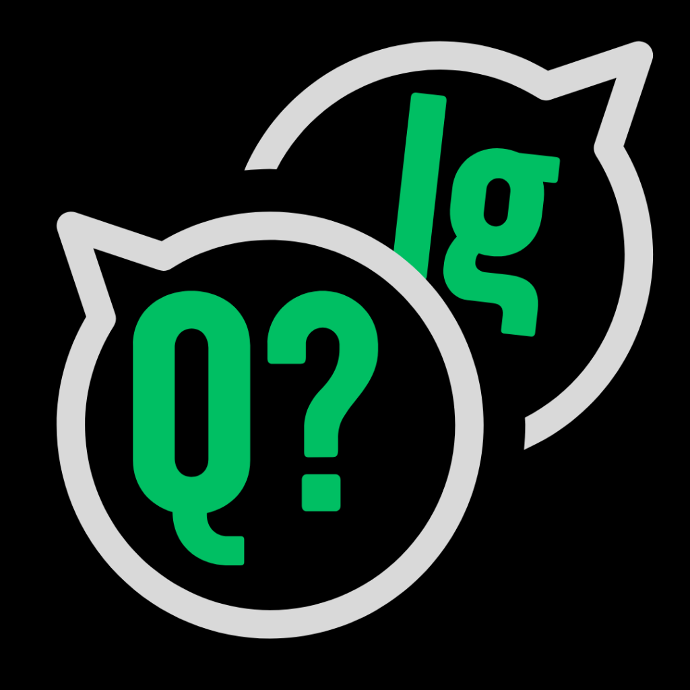

# Monorepo for Ignite

   

  
  
  
  
  
  
  
  
   

> Repository with al content developed by me in Ignite Experience of [Rocketseat](https://github.com/Rocketseat).

  

## 

  

### Trail 2024

-   <b><a href="/packages/imhere/README.md">
    
    ImHere</a> - Chapter 01: React Native fundaments</b>

-   <b><a href="/packages/ignite-desafio01-tarefas/README.md">
    
    to.do</a> - Challenge 01: React Native basics</b>

-   <b><a href="/packages/igniteteams/README.md">
    
    IgniteTeams</a> - Chapter 02: Interfaces, navigation and local storage</b>

-   <b><a href="/packages/dailydiet/README.md">
    
    Daily Diet</a> - Challenge 02</b>

-   <b><a href="/packages/ignite-gym/README.md">
    
    Ignite GYM</a> - Chapter 03: Components and API requests and Challenge 04: adding Push notifications</b>

-   <b><a href="/packages/marketspace/README.md">
    
    Marketspace</a> - Challenge 03: Components and API requests</b>

-   <b><a href="/packages/igniteshoesapp/README.md">
    
    IgniteShoes</a> - Chapter 04: Notifications push and deep linking</b>

-   <b><a href="/packages/ignite-quiz/README.md">
    
    IgniteQuiz</a> Chapter 05: Animations and feedbacks</b>

-   <b><a href="/packages/coffedelivery/README.md">
    
    CoffeeDelivery</a> Challenge 05: Animations and feedbacks</b>

-   <b><a href="/packages/ignite-fleet/README.md">
    
    Ignite Fleet</a> Chapter 06: Offiline first and geolocalization</b>

-   <b><a href="/packages/iweather-main/README.md">
    
    iWeather</a> Chapter 07 and 08 - Tests and deploy</b>

### Trail 2021

[**MySkills**](./packages/myskills/README.md)(Chapter 1)

-   <b><a href="/packages/ignite-desafio01-tarefas/README.md">
    
    to.do</a> - Challenge 01: React Native basics</b>

[**GoFinance**](./packages/gofinance/README.md) (Chapter 2)

[**SavePass**](./packages/ignite-savepass/README.md) (Chapter 2 - Challenge 1: SavePass App)

[**stream.data**](./packages/ignite-stream.data/README.md) (Chapter 2 - Challenge 2: Contexts and Login with Twitch)

[**RENTX**](./packages/rentx/README.md) (Chapter 3 - Consumes API/Chapter 4 - Offline First)

**RENTX backend** (Chapter 4 - Backend for mobile first on Ch-4)

[**GitHub Explorer**](./packages/gitHubExplorere/README.md) (Chapter 2 - Challenge 1: SavePass App)

[**performanceapp**](./packages/performanceapp/README.md) (Chapter 5 - Performing apps)

  

## 

  

-   <b><a href="/packages/ignite-feed/README.md">
    
    Ignitne Feed</a> - Chapter 01: Starting with ReactJS</b>

-   <b><a href="/packages/todoweb/README.md">
    
    To.Do</a> - Challenge 01: Todo app</b>

-   <b><a href="/packages/ignite-timer/README.md">
    
    Ignite Timer</a> - Chapter 02: Hooks and Context API</b>

-   <b><a href="/packages/coffeedelivery-web/README.md">
    
    CoffeeDelivery</a> - Challenge 02: CoffeDelivery WEB</b>

-   <b><a href="/packages/dt-money/README.md">
    
    DT-Money</a> - Chapter 03: Request API and performance</b>

-   <b><a href="/packages/github-blog/README.md">
    
    CoffeeDelivery</a> - Challenge 03: Github BLog</b>

-   <b><a href="/packages/pizza-shop/README.md">
    
    Pizza Shop</a> - Chapter 04: Integrating Frontend - Backend</b>

## Autor

<a alt="Linkedin" href="https://linkedin/in/josueplacido">
 
  
 <b>Josué Placido</b></a>

Feito com ❤️ por Josué Placido 👋🏽 Entre em contato!

## 📝 Licença

Este projeto esta sobe a licença [MIT](./LICENSE).
