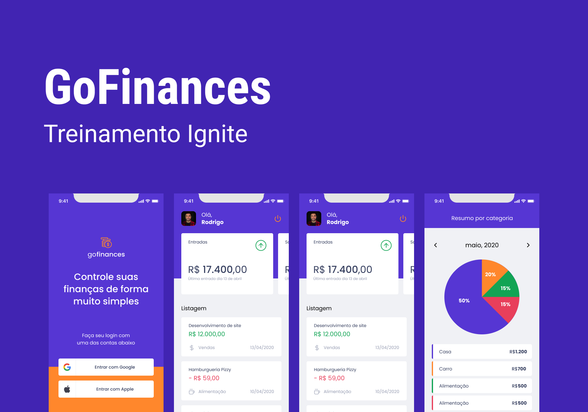

# GoFinances - Ignite | React Native

 

 

## :page_with_curl: About 

Application developed in the Rocketseat course (Ignite), where the focus of the course is the use of Firebase in React Native. We developed an application that has the responsibility to manage a finances transitions.

## Technologies 

### Requirements

-   [Git](https://git-scm.com)
-   [NodeJs](https://nodejs.org/en/)
-   [Expo](https://expo.dev/)
-   [Yarn](https://yarnpkg.com/) or [npm](https://www.npmjs.com/)

### Languages, frameworks and libs

-   [React](https://reactjs.org/)
-   [React Native](https://reactnative.dev/)
-   [styled-components](https://styled-components.com/)
-   [Typescript](https://www.typescriptlang.org/)
-   [Async Storage](https://react-native-async-storage.github.io/async-storage/): For CRUD in Storage
-   [React Navigation](https://reactnavigation.org/): Navigate between screens:
-   [babel-plugin-inline-dotenv](https://github.com/brysgo/babel-plugin-inline-dotenv): Reading environment variables
-   [Date fns](https://date-fns.org/): Calculate and format Dates
-   [Expo Apple Authentication](https://docs.expo.dev/versions/latest/sdk/apple-authentication/): Support login with Apple account
-   [Expo-Auth-Session](https://docs.expo.dev/versions/latest/sdk/auth-session/): Support for login social
-   [React Hook Form](https://react-hook-form.com/): Validation, perform fields
-   [react-native-iphone-x-helper](https://npm.io/package/react-native-iphone-x-helper): Get sizes of Specificx elements of Device
-   [react-native-responsive-fontsize](https://github.com/heyman333/react-native-responsive-fontSize): Turn the sizes responsives
-   [react-native-svg](https://github.com/react-native-svg/react-native-svg): Support the usage of SVGs files
-   [react-native-uuid](https://github.com/eugenehp/react-native-uuid): For generating UUIDs
-   [victory-native](https://formidable.com/open-source/victory/docs/native/): For generating charts
-   [yup](https://github.com/jquense/yup): Support modeling and validation with error messages
-   [react-native-svg-transformer](https://github.com/kristerkari/react-native-svg-transformer): Permit import SVG as a JSX/TSX component.

### Concepts studed or applied

-   Environment variable
-   Login social
-   Contexts
-   HookForm
-   AsyncStorage
-   styled-components and theme
-   stack and bottom tabs (react-navigation)
-   validation Yup
-   Rect and borderless buttons
-   Date manipulation (date-fns)
-   Responsive sizes and Percentage
-   SVG as component JSX
-   Typescript
-   StatusBar helper
-   UUID generation
-   Chart generation (victory-chart)

## Autor

<a alt="Linkedin" href="https://linkedin/in/josueplacido">
 
  
 <b>Josué Placido</b></a>

Developed ❤️ by Josué Placido! 👋🏽

