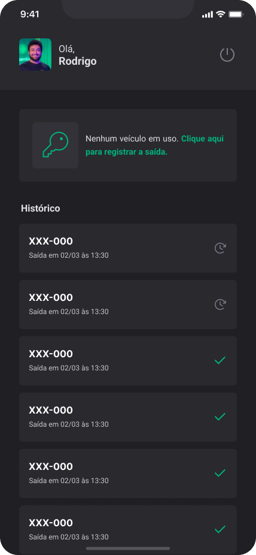

# Ignite fleet - Ignite | React Native

<span style="display: flex;">
 
</span>

<span style="display: flex; justify-content: center; align-items: center; gap: 10px">
	<a href="https://github.com/JosuePlacido/nlw-03/commits/master">
		
	</a>
	<a>
		
	</a>
</span>

## :computer: About <a id = "sobre"></a>

Ignite Fleet is a mobile application that allows users to track their vehicle's history departures and arrivals. Created with React Native and Expo.

<span style="display: flex;">
 
</span>

## 🎨 Layout <a id = "sobre"></a>

<span style="display: flex;align-items: flex-start; overflow-x: auto; gap: 5px;">
 
 
 
 
 
</span>

## Technologies <a id="tecs"></a>

### Requirements

-   [Git](https://git-scm.com)
-   [NodeJs](https://nodejs.org/en/)
-   [Expo](https://expo.dev/)
-   [Yarn](https://yarnpkg.com/) or [npm](https://www.npmjs.com/)

### :wrench: Languages, frameworks and libs

-   [React](https://reactjs.org/)
-   [React Native](https://reactnative.dev/)
-   [TypeScript](https://www.typescriptlang.org/)
-   [React Navigation](https://reactnavigation.org/)
-   [React Navigation Native Stack](https://reactnavigation.org/docs/native-stack-navigator/)
-   [dayjs](https://day.js.org/)
-   [realmDB](https://www.mongodb.com/pt-br/docs/atlas/device-sdks/)
-   [expo task manager](https://docs.expo.dev/versions/latest/sdk/task-manager/)
-   [expo location](https://docs.expo.dev/versions/latest/sdk/location/)
-   [dotenv](https://www.dotenv.org/)

### Concepts studed or applied

-   Login social with Google
-   realmDB and offlineFirst
-   synchronization cloud
-   Google maps api
-   get localizations on background
-   go to phone settings
-   create styled components variations
-   custom toast messages
-   custom map marker
-   using pt-BR on date
-   configuring environment variables

## 🚀 Run project

```bash
	cd packages/ignite-fleet

	#app
	npx expo prebuild
	yarn android # or npom run android
```

## Autor

<a alt="Linkedin" href="https://linkedin/in/josueplacido">
 
 <br />
 <sub><b>Josué Placido</b></sub></a>

Developed ❤️ by Josué Placido! 👋🏽

[](https://www.linkedin.com/in/josueplacido/)
[](mailto:juplacido.jnr@gmail.com)
[](mailto:ozzyplacidojunior@hotmail.com)
