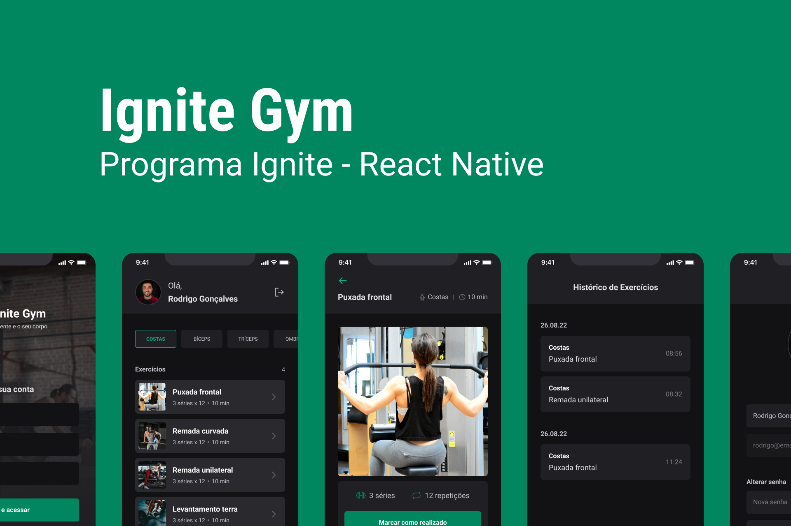
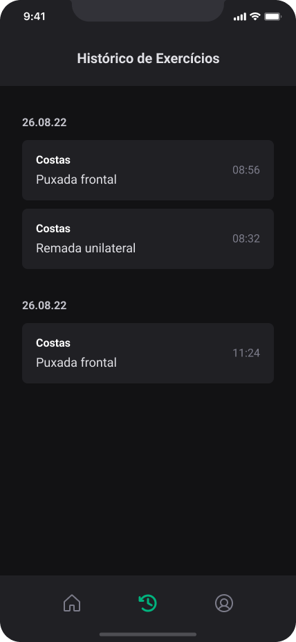

# Ignite GYM - Ignite | React Native

<div align="center">
	
</div>

## :page_with_curl: About <a id = "sobre"></a>

Application developed in the Rocketseat course (Ignite). We developed an application that has the responsibility to manager you exercise session in gym.

<span style="display: flex">
 
</span>

## 🎨 Layout <a id = "sobre"></a>

<span style="display: flex;align-items: flex-start; overflow-x: auto; gap: 5px;">
 
 
 
 
 
 
</span>

## Missions

[Challenge 4 - Push notifications](https://efficient-sloth-d85.notion.site/Desafio-04-Ignite-Gym-0067b49de9ca41f1a83fc1ed1b54c562)

-   added push notifications

## Technologies <a id="tecs"></a>

### Requirements

-   [![git-badge]](https://git-scm.com)
-   [![nodejs-badge]](https://nodejs.org/en)
-   [![yarn-badge]](https://yarnpkg.com/) or [![npm]](https://www.npmjs.com/)
-   [![expo]](https://expo.dev/)

### Languages, frameworks and libs

-   [![React]](https://reactjs.org/)
-   [![React-Native]](https://reactnative.dev/)
-   [![typescript]](https://www.typescriptlang.org/)
-   [![styled-components]](https://styled-components.com/)
-   [![React-Navigation]](https://reactnavigation.org/)
-   [![Native-base]](https://nativebase.io/)
-   [![one-signal]](https://onesignal.com/)
-   [react-hook-form](https://react-hook-form.com/)
-   [Async Storage](https://react-native-async-storage.github.io/async-storage/)
-   [yup](https://github.com/jquense/yup)

### Concepts studed or applied

-   Building interface with Component library
-   SVG as component JSX
-   validation with yup
-   control form with reac-hook-form
-   update picture with file in gallery
-   refresh token rotation strategy
-   upload image to api
-   notification push
-   deep linking
-   environment variable

### How to use 🚀

```bash
	# Configure the environment variable with .env file
	# EXPO_PUBLIC_ONE_SIGNAL_ID: id do app on OneSignal
	# EXPO_PUBLIC_API_ADDRESS: API address

	#access the project ignite-gym
	cd packages/ignite-gym

	#start the api project
	cd api
	yarn #npm run install
	yarn dev # or npm run dev

	#install dependencies
	yarn #npm run install

	#run app
	yarn android # npm run android

```

## Autor

<a alt="Linkedin" href="https://linkedin/in/josueplacido">
 
 <br />
 <sub><b>Josué Placido</b></sub></a>

Developed ❤️ by Josué Placido! 👋🏽

[](https://www.linkedin.com/in/josueplacido/)
[](mailto:juplacido.jnr@gmail.com)
[![Hotmail Badge](https://img.shields.io/badge/-ozzyplacidojunior@hotmail.com-blue?style=flat-square&logo=data:image/svg+xml;base64,PCFET0NUWVBFIHN2ZyBQVUJMSUMgIi0vL1czQy8vRFREIFNWRyAxLjEvL0VOIiAiaHR0cDovL3d3dy53My5vcmcvR3JhcGhpY3MvU1ZHLzEuMS9EVEQvc3ZnMTEuZHRkIj4KDTwhLS0gVXBsb2FkZWQgdG86IFNWRyBSZXBvLCB3d3cuc3ZncmVwby5jb20sIFRyYW5zZm9ybWVkIGJ5OiBTVkcgUmVwbyBNaXhlciBUb29scyAtLT4KPHN2ZyB3aWR0aD0iODAwcHgiIGhlaWdodD0iODAwcHgiIHZpZXdCb3g9IjAgMCAzMiAzMiIgeG1sbnM9Imh0dHA6Ly93d3cudzMub3JnLzIwMDAvc3ZnIiBmaWxsPSIjZmZmZmZmIj4KDTxnIGlkPSJTVkdSZXBvX2JnQ2FycmllciIgc3Ryb2tlLXdpZHRoPSIwIi8+Cg08ZyBpZD0iU1ZHUmVwb190cmFjZXJDYXJyaWVyIiBzdHJva2UtbGluZWNhcD0icm91bmQiIHN0cm9rZS1saW5lam9pbj0icm91bmQiLz4KDTxnIGlkPSJTVkdSZXBvX2ljb25DYXJyaWVyIj4KDTx0aXRsZT5maWxlX3R5cGVfb3V0bG9vazwvdGl0bGU+Cg08cGF0aCBkPSJNMTkuNDg0LDcuOTM3djUuNDc3TDIxLjQsMTQuNjE5YS40ODkuNDg5LDAsMCwwLC4yMSwwbDguMjM4LTUuNTU0YTEuMTc0LDEuMTc0LDAsMCwwLS45NTktMS4xMjhaIiBzdHlsZT0iZmlsbDojZmFmYWZhIi8+Cg08cGF0aCBkPSJNMTkuNDg0LDE1LjQ1N2wxLjc0NywxLjJhLjUyMi41MjIsMCwwLDAsLjU0MywwYy0uMy4xODEsOC4wNzMtNS4zNzgsOC4wNzMtNS4zNzhWMjEuMzQ1YTEuNDA4LDEuNDA4LDAsMCwxLTEuNDksMS41NTVIMTkuNDgzVjE1LjQ1N1oiIHN0eWxlPSJmaWxsOiNmYWZhZmEiLz4KDTxwYXRoIGQ9Ik0xMC40NCwxMi45MzJhMS42MDksMS42MDksMCwwLDAtMS40Mi44MzgsNC4xMzEsNC4xMzEsMCwwLDAtLjUyNiwyLjIxOEE0LjA1LDQuMDUsMCwwLDAsOS4wMiwxOC4yYTEuNiwxLjYsMCwwLDAsMi43NzEuMDIyLDQuMDE0LDQuMDE0LDAsMCwwLC41MTUtMi4yLDQuMzY5LDQuMzY5LDAsMCwwLS41LTIuMjgxQTEuNTM2LDEuNTM2LDAsMCwwLDEwLjQ0LDEyLjkzMloiIHN0eWxlPSJmaWxsOiNmYWZhZmEiLz4KDTxwYXRoIGQ9Ik0yLjE1Myw1LjE1NVYyNi41ODJMMTguNDUzLDMwVjJaTTEzLjA2MSwxOS40OTFhMy4yMzEsMy4yMzEsMCwwLDEtMi43LDEuMzYxLDMuMTksMy4xOSwwLDAsMS0yLjY0LTEuMzE4QTUuNDU5LDUuNDU5LDAsMCwxLDYuNzA2LDE2LjFhNS44NjgsNS44NjgsMCwwLDEsMS4wMzYtMy42MTZBMy4yNjcsMy4yNjcsMCwwLDEsMTAuNDg2LDExLjFhMy4xMTYsMy4xMTYsMCwwLDEsMi42MSwxLjMyMSw1LjYzOSw1LjYzOSwwLDAsMSwxLDMuNDg0QTUuNzYzLDUuNzYzLDAsMCwxLDEzLjA2MSwxOS40OTFaIiBzdHlsZT0iZmlsbDojZmFmYWZhIi8+Cg08L2c+Cg08L3N2Zz4=&link=mailto:ozzyplacidojunior@hotmail.com)](mailto:ozzyplacidojunior@hotmail.com)

<!-- variaveis badges -->

[contributors-shield]: https://img.shields.io/github/contributors/othneildrew/Best-README-Template.svg?style=for-the-badge
[contributors-url]: https://github.com/othneildrew/Best-README-Template/graphs/contributors
[nodejs-badge]: https://img.shields.io/badge/NODE.JS-339933?style=flat&logo=Node.js&logoColor=ffffff
[git-badge]: https://img.shields.io/badge/GIT-E44C30?style=flat&logo=git&logoColor=ffffff&labelColor=E44C30
[yarn-badge]: https://img.shields.io/badge/YARN-2C8EBB?style=flat&logo=yarn&logoColor=ffffff
[npm-badge]: https://img.shields.io/badge/any_text-18.18.x-black?style=flat&logo=Node.js&logoColor=ffffff&label=NodeJs&labelColor=339933
[npm]: https://img.shields.io/badge/NPM-CB3837?style=flat&logo=npm&logoColor=ffffff
[expo]: https://img.shields.io/badge/51.x-%235D5D5D?style=flat&logo=expo&logoColor=ffffff&label=EXPO&labelColor=1B1F23
[React]: https://img.shields.io/badge/18.2.x-5D5D5D?style=flat&logo=react&label=REACT&labelColor=20232A
[React-Native]: https://img.shields.io/badge/0.74.x-5D5D5D?style=flat&logo=react&label=REACT%20NATIVE&labelColor=20232A
[typescript]: https://img.shields.io/badge/5.x-5D5D5D?style=flat&logo=typescript&logoColor=fff&label=TYPESCRIPT&labelColor=007ACC
[styled-components]: https://img.shields.io/badge/STYLED--COMPONENTS-DB7093?style=flat&logo=styled-components&logoColor=fff
[React-Navigation]: https://img.shields.io/badge/REACT_NAVIGATION-613CC4?style=flat&logoColor=fff
[Native-base]: https://img.shields.io/badge/NATIVE_BASE-356290?style=flat&logo=data%3Aimage%2Fsvg%2Bxml%3Bbase64%2CPHN2ZyB3aWR0aD0iMTAyNCIgaGVpZ2h0PSIxMDI0IiB2aWV3Qm94PSIwIDAgMTAyNCAxMDI0IiBmaWxsPSJub25lIiB4bWxucz0iaHR0cDovL3d3dy53My5vcmcvMjAwMC9zdmciPgo8cGF0aCBkPSJNODg5IDY4My43NzVDODg4Ljk5NyA2OTIuOTgzIDg4Ni4zOCA3MDIuMDI5IDg4MS40MTMgNzEwLjAwM0M4NzYuNDQ1IDcxNy45NzggODY5LjMwMiA3MjQuNjAxIDg2MC43IDcyOS4yMDdMNTM5LjgxOSA5MDAuOTY4QzUzMS4yMSA5MDUuNTc1IDUyMS40NDQgOTA4IDUxMS41MDMgOTA4QzUwMS41NjIgOTA4IDQ5MS43OTYgOTA1LjU3NSA0ODMuMTg2IDkwMC45NjhMMTYyLjMgNzI5LjIwN0MxNTMuNjk4IDcyNC42MDEgMTQ2LjU1NSA3MTcuOTc4IDE0MS41ODcgNzEwLjAwM0MxMzYuNjIgNzAyLjAyOSAxMzQuMDAzIDY5Mi45ODMgMTM0IDY4My43NzVWMzQwLjIyNUMxMzQuMDAzIDMzMS4wMTcgMTM2LjYyIDMyMS45NzEgMTQxLjU4NyAzMTMuOTk3QzE0Ni41NTUgMzA2LjAyMiAxNTMuNjk4IDI5OS4zOTkgMTYyLjMgMjk0Ljc5M0w0ODMuMTk3IDEyMy4wMzJDNDkxLjgwNiAxMTguNDI1IDUwMS41NzIgMTE2IDUxMS41MTMgMTE2QzUyMS40NTUgMTE2IDUzMS4yMjEgMTE4LjQyNSA1MzkuODMgMTIzLjAzMkw4NjAuNyAyOTQuNzkzQzg2OS4zMDIgMjk5LjM5OSA4NzYuNDQ1IDMwNi4wMjIgODgxLjQxMyAzMTMuOTk3Qzg4Ni4zOCAzMjEuOTcxIDg4OC45OTcgMzMxLjAxNyA4ODkgMzQwLjIyNVY2ODMuNzc1WiIgZmlsbD0iIzM1NjI5MCIvPgo8cGF0aCBkPSJNODMzLjk2NSA2NDMuODU3QzgzMy45NjUgNjU2LjI1OSA4MzAuNDQzIDY2OC40NDIgODIzLjc1MyA2NzkuMTgyQzgxNy4wNjMgNjg5LjkyMiA4MDcuNDQxIDY5OC44NCA3OTUuODU0IDcwNS4wNDJMNTQ5LjYzMSA4MzYuODE0QzUzOC4wNDIgODQzLjAxNiA1MjQuODk2IDg0Ni4yODEgNTExLjUxNSA4NDYuMjgxQzQ5OC4xMzMgODQ2LjI4MSA0ODQuOTg3IDg0My4wMTYgNDczLjM5OCA4MzYuODE0TDIyNy4xODYgNzA1LjA0MkMyMTUuNTk5IDY5OC44NCAyMDUuOTc3IDY4OS45MjIgMTk5LjI4NyA2NzkuMTgyQzE5Mi41OTcgNjY4LjQ0MiAxODkuMDc1IDY1Ni4yNTkgMTg5LjA3NSA2NDMuODU3VjM4MC4yOThDMTg5LjA3NSAzNjcuODk2IDE5Mi41OTcgMzU1LjcxNCAxOTkuMjg3IDM0NC45NzNDMjA1Ljk3NyAzMzQuMjMzIDIxNS41OTkgMzI1LjMxNSAyMjcuMTg2IDMxOS4xMTRMNDczLjM5OCAxODcuMzQxQzQ4NC45ODcgMTgxLjEzOSA0OTguMTMzIDE3Ny44NzQgNTExLjUxNSAxNzcuODc0QzUyNC44OTYgMTc3Ljg3NCA1MzguMDQyIDE4MS4xMzkgNTQ5LjYzMSAxODcuMzQxTDc5NS44NTQgMzE5LjExNEM4MDcuNDQxIDMyNS4zMTUgODE3LjA2MyAzMzQuMjMzIDgyMy43NTMgMzQ0Ljk3M0M4MzAuNDQzIDM1NS43MTQgODMzLjk2NSAzNjcuODk2IDgzMy45NjUgMzgwLjI5OFY2NDMuODU3WiIgZmlsbD0iIzE3ODRCMiIvPgo8cGF0aCBkPSJNNzgxLjE3MiA2MzEuNzQ5Qzc4MS4xNzIgNjM5LjIwOCA3NzkuMDUzIDY0Ni41MzUgNzc1LjAyOSA2NTIuOTk1Qzc3MS4wMDYgNjU5LjQ1NCA3NjUuMjE4IDY2NC44MTggNzU4LjI0OSA2NjguNTQ4TDUzNC40MTUgNzg4LjMwMkM1MjcuNDQ2IDc5Mi4wMzEgNTE5LjU0IDc5My45OTUgNTExLjQ5MiA3OTMuOTk1QzUwMy40NDUgNzkzLjk5NSA0OTUuNTM5IDc5Mi4wMzEgNDg4LjU3IDc4OC4zMDJMMjY0LjczNiA2NjguNTQ4QzI1Ny43NjYgNjY0LjgxOCAyNTEuOTc5IDY1OS40NTQgMjQ3Ljk1NSA2NTIuOTk1QzI0My45MzIgNjQ2LjUzNSAyNDEuODEzIDYzOS4yMDggMjQxLjgxMyA2MzEuNzQ5VjM5Mi4yNDZDMjQxLjgxMyAzODQuNzg3IDI0My45MzIgMzc3LjQ1OSAyNDcuOTU1IDM3MUMyNTEuOTc5IDM2NC41NCAyNTcuNzY2IDM1OS4xNzYgMjY0LjczNiAzNTUuNDQ3TDQ4OC41OTEgMjM1LjY5M0M0OTUuNTYxIDIzMS45NjMgNTAzLjQ2NiAyMzAgNTExLjUxNCAyMzBDNTE5LjU2MiAyMzAgNTI3LjQ2NyAyMzEuOTYzIDUzNC40MzcgMjM1LjY5M0w3NTguMjQ5IDM1NS40NTJDNzY1LjIxOCAzNTkuMTgxIDc3MS4wMDYgMzY0LjU0NSA3NzUuMDI5IDM3MS4wMDVDNzc5LjA1MyAzNzcuNDY0IDc4MS4xNzIgMzg0Ljc5MiA3ODEuMTcyIDM5Mi4yNTFWNjMxLjc0OVoiIGZpbGw9IiM1MEJGQzMiLz4KPHBhdGggZD0iTTQ0Mi4wOTMgNTg4Ljg0MlY1NDUuMzE5TDM2MC4yNzcgNTE5LjgyNEw0NDIuMDkzIDQ5My42NThWNDUwLjEzNkwzMDkuMTQ2IDUwMC41OTdWNTM4LjM4MUw0NDIuMDkzIDU4OC44NDJaTTQ5MC42MzUgNjIyLjg4Nkw1NjYuMjUzIDQwMS4yNjlINTI5LjM3N0w0NTMuNzU5IDYyMi44ODZINDkwLjYzNVpNNTgwLjk0NSA1ODguODQyTDcxMy44OTIgNTM3Ljk3NlY1MDAuMzI3TDU4MC45NDUgNDUwLjEzMVY0OTQuNzIzTDY1NS4yNjkgNTIxLjgyM0w1ODAuOTQ1IDU0NC4zODRWNTg4Ljg0MloiIGZpbGw9IndoaXRlIi8%2BCjwvc3ZnPgo%3D&logoColor=fff
[one-signal]: https://img.shields.io/badge/ONE--SIGNAL-E54B4D?style=flat&logo=data%3Aimage%2Fsvg%2Bxml%3Bbase64%2CPHN2ZyB3aWR0aD0iMTAyNCIgaGVpZ2h0PSIxMDI0IiB2aWV3Qm94PSIwIDAgMTAyNCAxMDI0IiBmaWxsPSJub25lIiB4bWxucz0iaHR0cDovL3d3dy53My5vcmcvMjAwMC9zdmciPgo8cGF0aCBkPSJNNTEyLjE4NyA3M0MyNjcuMTg0IDczLjQ4NTcgNjcuNjA0IDI3Mi4zODUgNjkuMDA3NCA1MTQuNjUzQzY5LjYzNTQgNjIyLjk1NyAxMTAuNzE0IDcyNy4yMSAxODQuMzUgODA3LjM3OUMyNTcuOTg2IDg4Ny41NDggMzU4Ljk4MyA5MzcuOTc3IDQ2Ny45MzQgOTQ4Ljk3NEM0NjkuMDA3IDk0OS4wODEgNDcwLjA4NiA5NDguODQ3IDQ3MS4wMTYgOTQ4LjMwNkM0NzEuOTQ1IDk0Ny43NjYgNDcyLjY3NiA5NDYuOTQ2IDQ3My4xMDMgOTQ1Ljk2N0M0NzMuMzkgOTQ1LjMyNiA0NzMuNTQyIDk0NC42MzMgNDczLjU0OCA5NDMuOTMyVjUxMi4xMzJINDM5LjAyNUM0MzguMzUzIDUxMi4xMzUgNDM3LjY4OCA1MTIuMDA3IDQzNy4wNjcgNTExLjc1NUM0MzYuNDQ1IDUxMS41MDMgNDM1Ljg4IDUxMS4xMzIgNDM1LjQwNCA1MTAuNjYzQzQzNC45MjkgNTEwLjE5NSA0MzQuNTUxIDUwOS42MzggNDM0LjI5MyA1MDkuMDI1QzQzNC4wMzUgNTA4LjQxMSA0MzMuOTAzIDUwNy43NTQgNDMzLjkwMyA1MDcuMDlWNDM4Ljk0N0M0MzMuOSA0MzguMjgxIDQzNC4wMyA0MzcuNjIxIDQzNC4yODYgNDM3LjAwNUM0MzQuNTQzIDQzNi4zODkgNDM0LjkyIDQzNS44MyA0MzUuMzk2IDQzNS4zNTlDNDM1Ljg3MiA0MzQuODg4IDQzNi40MzggNDM0LjUxNSA0MzcuMDYxIDQzNC4yNjFDNDM3LjY4NCA0MzQuMDA4IDQzOC4zNTEgNDMzLjg3OSA0MzkuMDI1IDQzMy44ODJINTQ3LjMxN0M1NDcuOTg5IDQzMy44ODIgNTQ4LjY1NCA0MzQuMDEzIDU0OS4yNzQgNDM0LjI2OEM1NDkuODk0IDQzNC41MjMgNTUwLjQ1NyA0MzQuODk2IDU1MC45MzEgNDM1LjM2N0M1NTEuNDA1IDQzNS44MzcgNTUxLjc4IDQzNi4zOTYgNTUyLjAzNSA0MzcuMDFDNTUyLjI4OSA0MzcuNjI1IDU1Mi40MTkgNDM4LjI4MyA1NTIuNDE2IDQzOC45NDdWOTQzLjkzMkM1NTIuNDEyIDk0NC42MzkgNTUyLjU1OSA5NDUuMzM5IDU1Mi44NDcgOTQ1Ljk4N0M1NTMuMTM1IDk0Ni42MzQgNTUzLjU1NyA5NDcuMjE1IDU1NC4wODcgOTQ3LjY5QzU1NC42MTYgOTQ4LjE2NiA1NTUuMjQxIDk0OC41MjYgNTU1LjkyIDk0OC43NDdDNTU2LjU5OSA5NDguOTY4IDU1Ny4zMTggOTQ5LjA0NiA1NTguMDI5IDk0OC45NzRDNjcxLjM2OSA5MzcuNTQzIDc3NS45MjkgODgzLjQ2NSA4NTAuMDggNzk3LjkyOEM5MjQuMjMgNzEyLjM5MSA5NjIuMjk3IDYwMS45NCA5NTYuNDA1IDQ4OS40MjRDOTUwLjUxNCAzNzYuOTA3IDkwMS4xMTUgMjcwLjkzNSA4MTguNDI3IDE5My40M0M3MzUuNzM5IDExNS45MjQgNjI2LjA5MSA3Mi44MTYzIDUxMi4xNjMgNzMuMDIzMUw1MTIuMTg3IDczWk02MzguMzcxIDg1MS4xNTVDNjM3LjYwMSA4NTEuNDI2IDYzNi43NzYgODUxLjUxIDYzNS45NjYgODUxLjM5OUM2MzUuMTU2IDg1MS4yODggNjM0LjM4NSA4NTAuOTg3IDYzMy43MTggODUwLjUyQzYzMy4wNTEgODUwLjA1MyA2MzIuNTA3IDg0OS40MzQgNjMyLjEzMiA4NDguNzE1QzYzMS43NTcgODQ3Ljk5NiA2MzEuNTYzIDg0Ny4xOTkgNjMxLjU2NSA4NDYuMzkxVjc3NC4zMTZDNjMxLjU2MyA3NzIuODgyIDYzMS45NzMgNzcxLjQ3NyA2MzIuNzQ3IDc3MC4yNjVDNjMzLjUyMiA3NjkuMDUzIDYzNC42MjkgNzY4LjA4MyA2MzUuOTM5IDc2Ny40NjlDNjk0Ljg4NiA3MzkuNzI2IDc0Mi40NjEgNjkyLjg3MyA3NzAuNzYgNjM0LjY5NEM3OTkuMDU5IDU3Ni41MTUgODA2LjM3OCA1MTAuNTEyIDc5MS41MDIgNDQ3LjY1MUM3NzYuNjI2IDM4NC43ODkgNzQwLjQ1IDMyOC44NTMgNjg4Ljk4MyAyODkuMTM1QzYzNy41MTcgMjQ5LjQxNyA1NzMuODU5IDIyOC4zMDkgNTA4LjU4NSAyMjkuMzE2QzM1Ni42OTUgMjMxLjYyOSAyMzIuMDU0IDM1Mi43NjMgMjI3LjIxMiA1MDIuOTI2QzIyNS40NDggNTU3LjkxIDIzOS45MiA2MTIuMjExIDI2OC44NiA2NTkuMTkyQzI5Ny43OTkgNzA2LjE3MyAzMzkuOTUxIDc0My43OTggMzkwLjE2NSA3NjcuNDY5QzM5MS40OCA3NjguMDggMzkyLjU5MSA3NjkuMDQ4IDM5My4zNyA3NzAuMjYxQzM5NC4xNDkgNzcxLjQ3MyAzOTQuNTYyIDc3Mi44OCAzOTQuNTYyIDc3NC4zMTZWODQ2LjM5MUMzOTQuNTYgODQ3LjIgMzk0LjM2MiA4NDcuOTk3IDM5My45ODUgODQ4LjcxNkMzOTMuNjA3IDg0OS40MzQgMzkzLjA2MSA4NTAuMDUyIDM5Mi4zOTMgODUwLjUxOUMzOTEuNzI0IDg1MC45ODUgMzkwLjk1MiA4NTEuMjg3IDM5MC4xNDEgODUxLjM5N0MzODkuMzMgODUxLjUwOCAzODguNTA0IDg1MS40MjUgMzg3LjczMiA4NTEuMTU1QzMxNi45ODIgODI1LjQ3NSAyNTUuOTg2IDc3OC43OTcgMjEzLjA5NiA3MTcuNTEyQzE3MC4yMDUgNjU2LjIyNyAxNDcuNTE1IDU4My4zMzEgMTQ4LjEzMyA1MDguODAxQzE0OS44NjQgMzEyLjc0NyAzMTEuODU4IDE1Mi42ODQgNTEwLjE1MiAxNTEuMjVDNzEyLjc0OSAxNDkuNjMxIDg3Ny45NzEgMzEyLjE0NiA4NzcuOTcxIDUxMi4xMzJDODc3Ljk3MSA2NjcuNjM4IDc3OC4wOTkgODAwLjQ3NyA2MzguMzcxIDg1MS4xNTVaIiBmaWxsPSJ3aGl0ZSIvPgo8L3N2Zz4K&logoColor=fff
