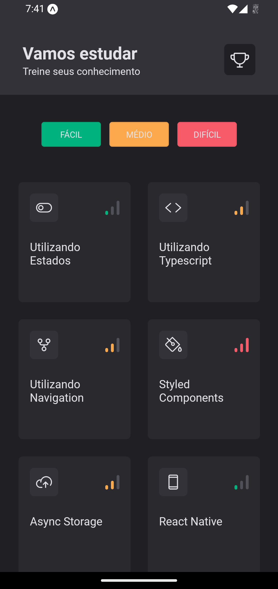
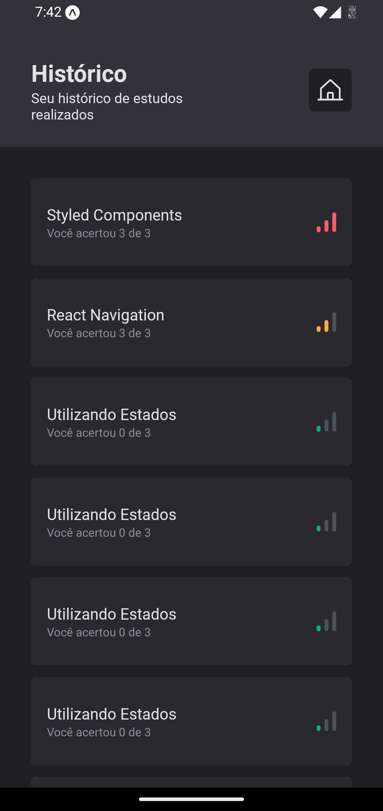
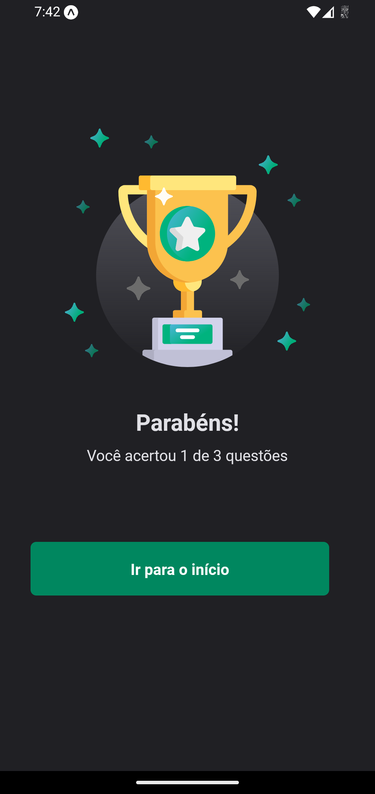

# Coffe delivery - Ignite | React Native

<span style="display: flex;">
 
</span>

<span style="display: flex; justify-content: center; align-items: center; gap: 10px">
	<a href="https://github.com/JosuePlacido/nlw-03/commits/master">
		
	</a>
	<a>
		
	</a>
</span>

## :computer: About <a id = "sobre"></a>

Coffee Delivery is a mobile application for purchasing coffees. This challenge is focused on building animations. This project is one of the challenges of the Ignite React Native course.

This app you can filter a list of coffees and adding to cart, to confirm the order you must be choose a size.
this app have some animations and feedbacks for the gestures of user.

<span style="display: flex;">
 
</span>

## 🎨 Layout <a id = "sobre"></a>

<span style="display: flex;align-items: flex-start; overflow-x: auto; gap: 5px;">
 
 
 
 
 
</span>

## Technologies <a id="tecs"></a>

### Requirements

-   [Git](https://git-scm.com)
-   [NodeJs](https://nodejs.org/en/)
-   [Expo](https://expo.dev/)
-   [Yarn](https://yarnpkg.com/) or [npm](https://www.npmjs.com/)

### :wrench: Languages, frameworks and libs

-   [React](https://reactjs.org/)
-   [React Native](https://reactnative.dev/)
-   [TypeScript](https://www.typescriptlang.org/)
-   [Async Storage](https://reactnative.dev/docs/asyncstorage)
-   [React Navigation](https://reactnavigation.org/)
-   [React Navigation Native Stack](https://reactnavigation.org/docs/native-stack-navigator/)
-   [Expo Google Fonts](https://github.com/expo/google-fonts)
-   [React Native Skia](https://docs.expo.dev/versions/latest/sdk/skia/)
-   [React Native Gesture Handler](https://docs.swmansion.com/react-native-gesture-handler/docs/)
-   [React Native Reanimated](https://docs.swmansion.com/react-native-reanimated/)
-   [Expo-AV](https://docs.expo.dev/versions/latest/sdk/av/)
-   [Expo Haptics](https://docs.expo.dev/versions/latest/sdk/haptics/)

### Concepts studed or applied

-   SVG as component JSX
-   animations with React-Native Reanimated
-   using default animations
-   create custom animations with key frame
-   drawing object and simples animations with Skia
-   playing sound and vibrate the phone
-   animating from SVG content
-   capturing user gesture and animate the interface

## 🚀 Run project

```bash
	cd packages/ignite-quiz

	#app
	yarn start # or yarn android
```

## Autor

<a alt="Linkedin" href="https://linkedin/in/josueplacido">
 
 <br />
 <sub><b>Josué Placido</b></sub></a>

Developed ❤️ by Josué Placido! 👋🏽

[](https://www.linkedin.com/in/josueplacido/)
[](mailto:juplacido.jnr@gmail.com)
[](mailto:ozzyplacidojunior@hotmail.com)
