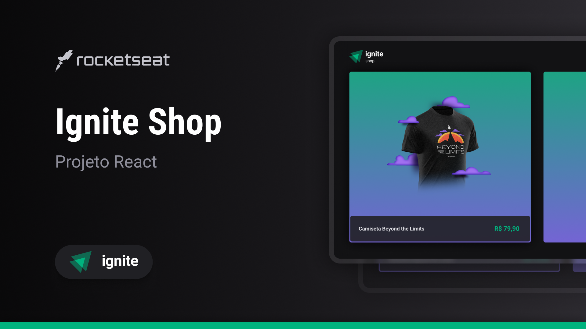

# ignite-shop

<div align="center">
 
</div>

## :computer: About <a id = "sobre"></a>

It's a application to .

The layout on [FIGMA](https://www.figma.com/file/nti0vr1hSqBOndAy4hnKPt/Ignite-Shop-%E2%80%A2-Projeto-React-Copy?fuid=885286489706210191).

<span style="display: flex;">
 
</span>

## Technologies <a id="tecs"></a>

### Requirements

-   [![git-badge]](https://git-scm.com)
-   [![nodejs-badge]](https://nodejs.org/en)
-   [![yarn-badge]](https://yarnpkg.com/) or [![npm]](https://www.npmjs.com/)

### Languages, frameworks and libs

-   [![typescript]](https://www.typescriptlang.org/)
-   [![React]](https://reactjs.org/)
-   [![Next]](https://nextjs.org/)
-   [![stitches]](https://stitches.dev/)

### Concepts studed or applied

-   Next Framework

## 🚀 Run project

```bash
# access the project folder
cd pckages/ignite-shop

 #install dependencies
 yarn # or npm install

 #start app
 yarn dev # or npm run dev
```

## Autor

<a alt="Linkedin" href="https: //linkedin/in/josueplacido">
 
 <br />
 <sub><b>Josué Placido</b></sub></a>

Developed ❤️ by Josué Placido! 👋🏽

[](https://www.linkedin.com/in/josueplacido/)
[](mailto:juplacido.jnr@gmail.com)
[![Hotmail Badge](https://img.shields.io/badge/-ozzyplacidojunior@hotmail.com-blue?style=flat-square&logo=data:image/svg+xml;base64,PCFET0NUWVBFIHN2ZyBQVUJMSUMgIi0vL1czQy8vRFREIFNWRyAxLjEvL0VOIiAiaHR0cDovL3d3dy53My5vcmcvR3JhcGhpY3MvU1ZHLzEuMS9EVEQvc3ZnMTEuZHRkIj4KDTwhLS0gVXBsb2FkZWQgdG86IFNWRyBSZXBvLCB3d3cuc3ZncmVwby5jb20sIFRyYW5zZm9ybWVkIGJ5OiBTVkcgUmVwbyBNaXhlciBUb29scyAtLT4KPHN2ZyB3aWR0aD0iODAwcHgiIGhlaWdodD0iODAwcHgiIHZpZXdCb3g9IjAgMCAzMiAzMiIgeG1sbnM9Imh0dHA6Ly93d3cudzMub3JnLzIwMDAvc3ZnIiBmaWxsPSIjZmZmZmZmIj4KDTxnIGlkPSJTVkdSZXBvX2JnQ2FycmllciIgc3Ryb2tlLXdpZHRoPSIwIi8+Cg08ZyBpZD0iU1ZHUmVwb190cmFjZXJDYXJyaWVyIiBzdHJva2UtbGluZWNhcD0icm91bmQiIHN0cm9rZS1saW5lam9pbj0icm91bmQiLz4KDTxnIGlkPSJTVkdSZXBvX2ljb25DYXJyaWVyIj4KDTx0aXRsZT5maWxlX3R5cGVfb3V0bG9vazwvdGl0bGU+Cg08cGF0aCBkPSJNMTkuNDg0LDcuOTM3djUuNDc3TDIxLjQsMTQuNjE5YS40ODkuNDg5LDAsMCwwLC4yMSwwbDguMjM4LTUuNTU0YTEuMTc0LDEuMTc0LDAsMCwwLS45NTktMS4xMjhaIiBzdHlsZT0iZmlsbDojZmFmYWZhIi8+Cg08cGF0aCBkPSJNMTkuNDg0LDE1LjQ1N2wxLjc0NywxLjJhLjUyMi41MjIsMCwwLDAsLjU0MywwYy0uMy4xODEsOC4wNzMtNS4zNzgsOC4wNzMtNS4zNzhWMjEuMzQ1YTEuNDA4LDEuNDA4LDAsMCwxLTEuNDksMS41NTVIMTkuNDgzVjE1LjQ1N1oiIHN0eWxlPSJmaWxsOiNmYWZhZmEiLz4KDTxwYXRoIGQ9Ik0xMC40NCwxMi45MzJhMS42MDksMS42MDksMCwwLDAtMS40Mi44MzgsNC4xMzEsNC4xMzEsMCwwLDAtLjUyNiwyLjIxOEE0LjA1LDQuMDUsMCwwLDAsOS4wMiwxOC4yYTEuNiwxLjYsMCwwLDAsMi43NzEuMDIyLDQuMDE0LDQuMDE0LDAsMCwwLC41MTUtMi4yLDQuMzY5LDQuMzY5LDAsMCwwLS41LTIuMjgxQTEuNTM2LDEuNTM2LDAsMCwwLDEwLjQ0LDEyLjkzMloiIHN0eWxlPSJmaWxsOiNmYWZhZmEiLz4KDTxwYXRoIGQ9Ik0yLjE1Myw1LjE1NVYyNi41ODJMMTguNDUzLDMwVjJaTTEzLjA2MSwxOS40OTFhMy4yMzEsMy4yMzEsMCwwLDEtMi43LDEuMzYxLDMuMTksMy4xOSwwLDAsMS0yLjY0LTEuMzE4QTUuNDU5LDUuNDU5LDAsMCwxLDYuNzA2LDE2LjFhNS44NjgsNS44NjgsMCwwLDEsMS4wMzYtMy42MTZBMy4yNjcsMy4yNjcsMCwwLDEsMTAuNDg2LDExLjFhMy4xMTYsMy4xMTYsMCwwLDEsMi42MSwxLjMyMSw1LjYzOSw1LjYzOSwwLDAsMSwxLDMuNDg0QTUuNzYzLDUuNzYzLDAsMCwxLDEzLjA2MSwxOS40OTFaIiBzdHlsZT0iZmlsbDojZmFmYWZhIi8+Cg08L2c+Cg08L3N2Zz4=&link=mailto:ozzyplacidojunior@hotmail.com)](mailto:ozzyplacidojunior@hotmail.com)

<!-- variaveis badges -->

[nodejs-badge]: https://img.shields.io/badge/NODE.JS-339933?style=flat&logo=Node.js&logoColor=ffffff
[git-badge]: https://img.shields.io/badge/GIT-E44C30?style=flat&logo=git&logoColor=ffffff&labelColor=E44C30
[yarn-badge]: https://img.shields.io/badge/YARN-2C8EBB?style=flat&logo=yarn&logoColor=ffffff
[npm-badge]: https://img.shields.io/badge/any_text-18.18.x-black?style=flat&logo=Node.js&logoColor=ffffff&label=NodeJs&labelColor=339933
[npm]: https://img.shields.io/badge/NPM-CB3837?style=flat&logo=npm&logoColor=ffffff
[React]: https://img.shields.io/badge/18.x-5D5D5D?style=flat&logo=react&label=REACT&labelColor=20232A
[typescript]: https://img.shields.io/badge/5.x-5D5D5D?style=flat&logo=typescript&logoColor=fff&label=TYPESCRIPT&labelColor=007ACC
[radix]: https://img.shields.io/badge/RADIX-%23E9E4FE?style=flat&logo=data%3Aimage%2Fsvg%2Bxml%3Bbase64%2CPHN2ZyB4bWxucz0iaHR0cDovL3d3dy53My5vcmcvMjAwMC9zdmciIHdpZHRoPSIzNSIgaGVpZ2h0PSIzNSIgdmlld0JveD0iMCAwIDM1IDM1IiBmaWxsPSIjMUMyMDI0Ij4KICA8cGF0aCBkPSJNMTcgMzVDMTAuMzcyNiAzNSA1IDMwLjA3NTEgNSAyNEM1IDE3LjkyNDkgMTAuMzcyNiAxMyAxNyAxM0wxNyAzNVoiIC8%2BCiAgPHJlY3QgeD0iNSIgd2lkdGg9IjEyIiBoZWlnaHQ9IjEyIiAvPgogIDxjaXJjbGUgY3g9IjI0IiBjeT0iNiIgcj0iNiIgLz4KPC9zdmc%2BCg%3D%3D
[axios]: https://img.shields.io/badge/AXIOS-671ddf?style=flat&logo=axios
[zod]: https://img.shields.io/badge/ZOD-000?style=flat&logo=zod&logoColor=3068B7
[shadcnui]: https://img.shields.io/badge/shadcn%2Fui-000000?style=flat&logo=shadcnui
[jest]: https://img.shields.io/badge/JEST-C21325?style=flat&logo=jest&logoColor=ffffff
[github-actions]: https://img.shields.io/badge/GITHUB_ACTIONS-282a2e?style=flat&logo=github-actions&logoColor=ffffff
[next]: https://img.shields.io/badge/NEXT%20JS-000000?style=flat&logo=nextdotjs&logoColor=white
[stitches]: https://img.shields.io/badge/STITCHES-fff?style=flat&logo=data%3Aimage%2Fsvg%2Bxml%3Bbase64%2CPHN2ZyB4bWxucz0iaHR0cDovL3d3dy53My5vcmcvMjAwMC9zdmciIHdpZHRoPSIzNSIgaGVpZ2h0PSIzNSIgdmlld0JveD0iMCAwIDM1IDM1IiBmaWxsPSJub25lIj48Y2lyY2xlIGN4PSIxNy41IiBjeT0iMTcuNSIgcj0iMTQuNSIgc3Ryb2tlPSJjdXJyZW50Q29sb3IiIHN0cm9rZS13aWR0aD0iMiI%2BPC9jaXJjbGU%2BPHBhdGggZD0iTTEyLjgxODQgMzEuMzIxOEwzMS44NzA5IDIwLjMyMTgiIHN0cm9rZT0iY3VycmVudENvbG9yIj48L3BhdGg%2BPHBhdGggZD0iTTMuMzE4MzYgMTQuODY3NEwyMi4zNzA5IDMuODY3NDMiIHN0cm9rZT0iY3VycmVudENvbG9yIj48L3BhdGg%2BPHBhdGggZD0iTTguNjUzMzIgMjkuMTA3N0wyNS45NzM4IDE5LjEwNzciIHN0cm9rZT0iY3VycmVudENvbG9yIiBzdHJva2UtbGluZWNhcD0icm91bmQiIHN0cm9rZS1saW5lam9pbj0icm91bmQiPjwvcGF0aD48cGF0aCBkPSJNOS4yMTU4MiAxNi4wODE1TDI2LjUzNjMgNi4wODE1NCIgc3Ryb2tlPSJjdXJyZW50Q29sb3IiIHN0cm9rZS1saW5lY2FwPSJyb3VuZCI%2BPC9wYXRoPjxwYXRoIGQ9Ik0xMy4yMzM0IDE0LjIyOTdMMjIuNTA5OSAyMS4xMDc3IiBzdHJva2U9ImN1cnJlbnRDb2xvciIgc3Ryb2tlLWxpbmVjYXA9InJvdW5kIiBzdHJva2UtbGluZWpvaW49InJvdW5kIj48L3BhdGg%2BPHBhdGggZD0iTTE2LjY5NzMgMTIuMjMwMkwyNS45NzM2IDE5LjEwNzgiIHN0cm9rZT0iY3VycmVudENvbG9yIiBzdHJva2UtbGluZWNhcD0icm91bmQiIHN0cm9rZS1saW5lam9pbj0icm91bmQiPjwvcGF0aD48cGF0aCBkPSJNOS4yMTU4MiAxNi4wODE1TDE5LjA0NTkgMjMuMTA3OCIgc3Ryb2tlPSJjdXJyZW50Q29sb3IiIHN0cm9rZS1saW5lY2FwPSJyb3VuZCIgc3Ryb2tlLWxpbmVqb2luPSJyb3VuZCI%2BPC9wYXRoPjwvc3ZnPgo%3D
