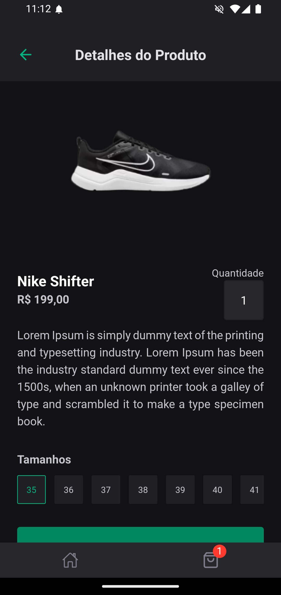
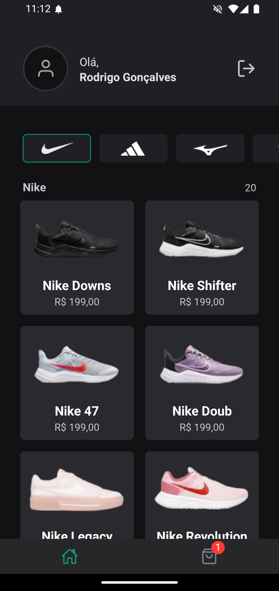
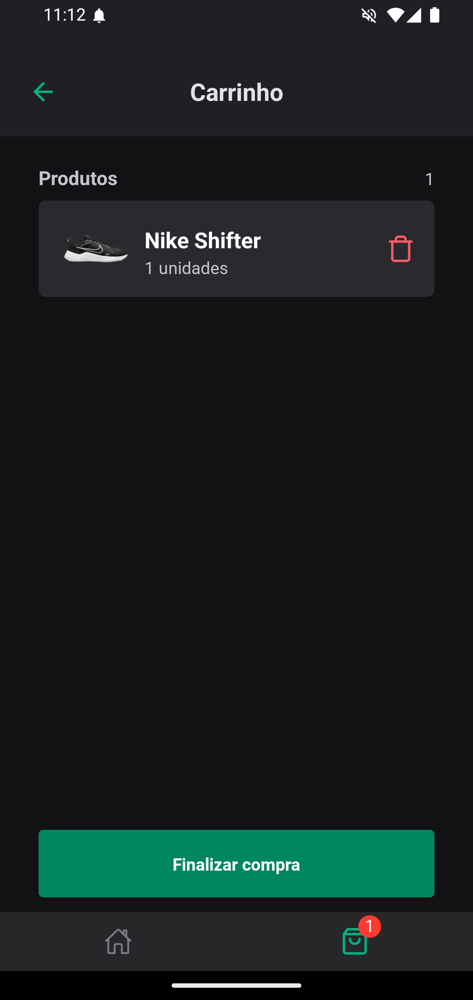

# Ignite shoes - Ignite | React Native

 

## Layout

 
 
 
 
 

## :page_with_curl: About 

Application developed in the Rocketseat course (Ignite). We developed an application for shoes fans, where they can buy your favourite model.

## Technologies 

### Requirements

-   [Git](https://git-scm.com)
-   [NodeJs](https://nodejs.org/en/)
-   [Expo](https://expo.dev/)
-   [Yarn](https://yarnpkg.com/) or [npm](https://www.npmjs.com/)

### Concepts studed or applied

-   Pushing notifications
-   Deep linking
-   OneSignal usage
-   Development builds
-   Bare workflow and expo dev client

## Autor

<a alt="Linkedin" href="https://linkedin/in/josueplacido">
 
  
 <b>Josué Placido</b></a>

Developed ❤️ by Josué Placido! 👋🏽

