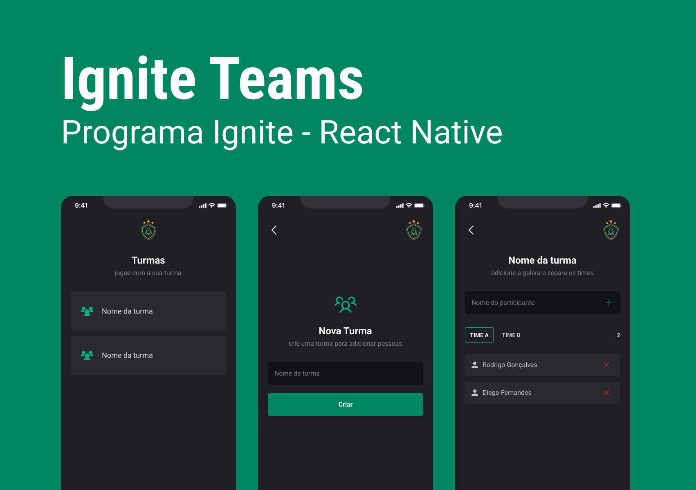

# IgniteTeam - Ignite | React Native

 

## :computer: About 

Application that stores classes and players in certain teams.

## 🎨 Layout 

 

## :wrench: Concepts

-   States
-   State immutability
-   Lists and keys in React Native
-   Properties
-   Componentization

## Technologies 

### Requirements

-   [Git](https://git-scm.com)
-   [NodeJs](https://nodejs.org/en/)
-   [Expo](https://expo.dev/)
-   [Yarn](https://yarnpkg.com/) or [npm](https://www.npmjs.com/)

### :wrench: Languages, frameworks and libs

-   [React](https://reactjs.org/)
-   [React Native](https://reactnative.dev/)
-   [styled-components](https://styled-components.com/)
-   [Typescript](https://www.typescriptlang.org/)
-   [Async Storage](https://react-native-async-storage.github.io/async-storage/): For CRUD in Storage
-   [React Navigation](https://reactnavigation.org/): Navigate between screens:

### 📖 Concepts studed or applied

-   styled-components and theme
-   stack navigation
-   navigation types
-   States and mutability
-   Componetization

## Autor

<a alt="Linkedin" href="https://linkedin/in/josueplacido">
 
  
 <b>Josué Placido</b></a>

Developed ❤️ by Josué Placido! 👋🏽

