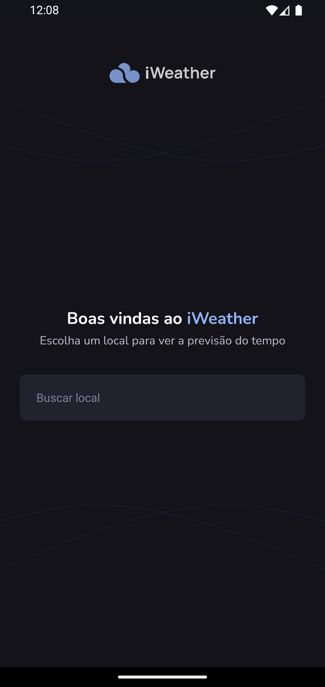
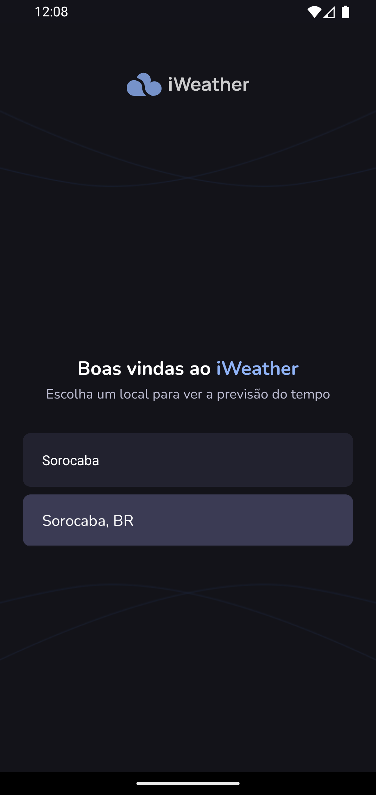
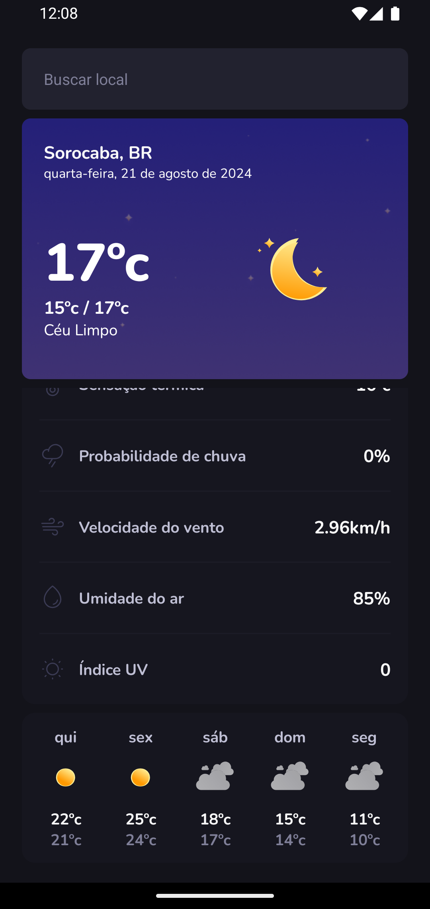

# Ignite fleet - Ignite | React Native

<span style="display: flex;">
 
</span>

<span style="display: flex; justify-content: center; align-items: center; gap: 10px">
	<a href="https://github.com/JosuePlacido/nlw-03/commits/master">
		
	</a>
	<a>
		
	</a>
</span>

## :computer: About <a id = "sobre"></a>

IWeather is app that allows users to view instant weather information from around the world. Users can see the weather forecast for the cities they want, save their favorite cities and access detailed weather information.

The application is designed with a modern and user-friendly interface, so users can quickly and easily access the weather information they want.

## 🎨 Layout <a id = "sobre"></a>

<span style="display: flex;align-items: flex-start; overflow-x: auto; gap: 5px;">
 
 
 
</span>

## Technologies <a id="tecs"></a>

### Requirements

-   [Git](https://git-scm.com)
-   [NodeJs](https://nodejs.org/en/)
-   [Expo](https://expo.dev/)
-   [Yarn](https://yarnpkg.com/) or [npm](https://www.npmjs.com/)

### :wrench: Languages, frameworks and libs

-   [React](https://reactjs.org/)
-   [React Native](https://reactnative.dev/)
-   [TypeScript](https://www.typescriptlang.org/)
-   [React Navigation](https://reactnavigation.org/)
-   [React Navigation Native Stack](https://reactnavigation.org/docs/native-stack-navigator/)
-   [jest](https://jestjs.io/pt-BR/)

### Concepts studed or applied

-   Unit tests
-   render components and contexts
-   mocks hooks and functions
-   before and after
-   asynchonous tests
-   coverages

## 🚀 Run project

```bash
	cd packages/iweather-main

	#app
	yarn start # or npom run start
```

## Autor

<a alt="Linkedin" href="https://linkedin/in/josueplacido">
 
 <br />
 <sub><b>Josué Placido</b></sub></a>

Developed ❤️ by Josué Placido! 👋🏽

[](https://www.linkedin.com/in/josueplacido/)
[](mailto:juplacido.jnr@gmail.com)
[](mailto:ozzyplacidojunior@hotmail.com)
