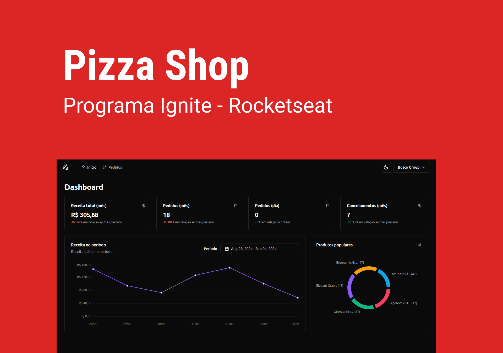

# Pizza.Shop - ReactJS

<div align="center">
 
</div>

## :computer: About <a id = "sobre"></a>

It's a application to manage, and analise orders of user's restaurant.

the puprpose of building this app was on shadcn/ui usage, and connections with API, learn about HTTP states, and Testing the front end app

<span style="display: flex;">
 
</span>

## Technologies <a id="tecs"></a>

### Requirements

-   [![git-badge]](https://git-scm.com)
-   [![nodejs-badge]](https://nodejs.org/en)
-   [![yarn-badge]](https://yarnpkg.com/) or [![npm]](https://www.npmjs.com/)

### Languages, frameworks and libs

-   [![typescript]](https://www.typescriptlang.org/)
-   [![React]](https://reactjs.org/)
-   [![vite]](https://vitejs.dev/)
-   [![shadcnui]](https://ui.shadcn.com/)
-   [![radix]](https://www.radix-ui.com/)
-   [![axios]](https://axios-http.com/)
-   [![zod]](https://zod.dev/)
-   [![react-router]](https://reactrouter.com/en/main)
-   [![jest]](https://jestjs.io/pt-BR/)
-   [![react-query]](https://tanstack.com/query/latest)
-   [![msw]](https://mswjs.io/)
-   [![vitest]](https://vitest.dev/)
-   [![playwright]](https://playwright.dev/)
-   [![testing-library]](https://testing-library.com/)
-   [React-hook-form](https://react-hook-form.com/)
-   [react-helmet-async](https://github.com/staylor/react-helmet-async#readme)
-   [recharts](https://recharts.org/en-US/)

### Concepts studed or applied

-   using component library
-   changind meta and title tags on head
-   create commercial charts
-   password less login
-   manage HTTP state
-   read and update cache STATE
-   NotFound and Error page config
-   Shimmer/Skeleton on load
-   unit tests
-   mock providers e check renders
-   testing renderers
-   mocking api requests
-   testing end to end

## 🚀 Run project

```bash

	#access the project folder
	cd packages/pizza-shop

	#access the server
	cd api

	# configure .env.local variables
	# This project depends on Docker to setup database. With Docker installed,
	# install  dependencies, setup Docker containers and run the application.
	# You must also run migrations to create database tables and run the seed
	# to populate the database with fake data.
	# if you dont have bun installed globally, you can install on project
	# with yarn add or npm install, however this local installation requires yarn
	# or npm run before all bun commands

	bun i # install api dependencies
	docker compose up -d # start the docker
	bun migrate # create the tables
	bun seed # generate and register data
	bun dev # start the server

	# go back main project folder
	cd ..

    #install dependencies
    yarn # or npm install

    #start app
    yarn dev # or npm run dev

```

## Autor

<a alt="Linkedin" href="https: //linkedin/in/josueplacido">
 
 <br />
 <sub><b>Josué Placido</b></sub></a>

Developed ❤️ by Josué Placido! 👋🏽

[](https://www.linkedin.com/in/josueplacido/)
[](mailto:juplacido.jnr@gmail.com)
[![Hotmail Badge](https://img.shields.io/badge/-ozzyplacidojunior@hotmail.com-blue?style=flat-square&logo=data:image/svg+xml;base64,PCFET0NUWVBFIHN2ZyBQVUJMSUMgIi0vL1czQy8vRFREIFNWRyAxLjEvL0VOIiAiaHR0cDovL3d3dy53My5vcmcvR3JhcGhpY3MvU1ZHLzEuMS9EVEQvc3ZnMTEuZHRkIj4KDTwhLS0gVXBsb2FkZWQgdG86IFNWRyBSZXBvLCB3d3cuc3ZncmVwby5jb20sIFRyYW5zZm9ybWVkIGJ5OiBTVkcgUmVwbyBNaXhlciBUb29scyAtLT4KPHN2ZyB3aWR0aD0iODAwcHgiIGhlaWdodD0iODAwcHgiIHZpZXdCb3g9IjAgMCAzMiAzMiIgeG1sbnM9Imh0dHA6Ly93d3cudzMub3JnLzIwMDAvc3ZnIiBmaWxsPSIjZmZmZmZmIj4KDTxnIGlkPSJTVkdSZXBvX2JnQ2FycmllciIgc3Ryb2tlLXdpZHRoPSIwIi8+Cg08ZyBpZD0iU1ZHUmVwb190cmFjZXJDYXJyaWVyIiBzdHJva2UtbGluZWNhcD0icm91bmQiIHN0cm9rZS1saW5lam9pbj0icm91bmQiLz4KDTxnIGlkPSJTVkdSZXBvX2ljb25DYXJyaWVyIj4KDTx0aXRsZT5maWxlX3R5cGVfb3V0bG9vazwvdGl0bGU+Cg08cGF0aCBkPSJNMTkuNDg0LDcuOTM3djUuNDc3TDIxLjQsMTQuNjE5YS40ODkuNDg5LDAsMCwwLC4yMSwwbDguMjM4LTUuNTU0YTEuMTc0LDEuMTc0LDAsMCwwLS45NTktMS4xMjhaIiBzdHlsZT0iZmlsbDojZmFmYWZhIi8+Cg08cGF0aCBkPSJNMTkuNDg0LDE1LjQ1N2wxLjc0NywxLjJhLjUyMi41MjIsMCwwLDAsLjU0MywwYy0uMy4xODEsOC4wNzMtNS4zNzgsOC4wNzMtNS4zNzhWMjEuMzQ1YTEuNDA4LDEuNDA4LDAsMCwxLTEuNDksMS41NTVIMTkuNDgzVjE1LjQ1N1oiIHN0eWxlPSJmaWxsOiNmYWZhZmEiLz4KDTxwYXRoIGQ9Ik0xMC40NCwxMi45MzJhMS42MDksMS42MDksMCwwLDAtMS40Mi44MzgsNC4xMzEsNC4xMzEsMCwwLDAtLjUyNiwyLjIxOEE0LjA1LDQuMDUsMCwwLDAsOS4wMiwxOC4yYTEuNiwxLjYsMCwwLDAsMi43NzEuMDIyLDQuMDE0LDQuMDE0LDAsMCwwLC41MTUtMi4yLDQuMzY5LDQuMzY5LDAsMCwwLS41LTIuMjgxQTEuNTM2LDEuNTM2LDAsMCwwLDEwLjQ0LDEyLjkzMloiIHN0eWxlPSJmaWxsOiNmYWZhZmEiLz4KDTxwYXRoIGQ9Ik0yLjE1Myw1LjE1NVYyNi41ODJMMTguNDUzLDMwVjJaTTEzLjA2MSwxOS40OTFhMy4yMzEsMy4yMzEsMCwwLDEtMi43LDEuMzYxLDMuMTksMy4xOSwwLDAsMS0yLjY0LTEuMzE4QTUuNDU5LDUuNDU5LDAsMCwxLDYuNzA2LDE2LjFhNS44NjgsNS44NjgsMCwwLDEsMS4wMzYtMy42MTZBMy4yNjcsMy4yNjcsMCwwLDEsMTAuNDg2LDExLjFhMy4xMTYsMy4xMTYsMCwwLDEsMi42MSwxLjMyMSw1LjYzOSw1LjYzOSwwLDAsMSwxLDMuNDg0QTUuNzYzLDUuNzYzLDAsMCwxLDEzLjA2MSwxOS40OTFaIiBzdHlsZT0iZmlsbDojZmFmYWZhIi8+Cg08L2c+Cg08L3N2Zz4=&link=mailto:ozzyplacidojunior@hotmail.com)](mailto:ozzyplacidojunior@hotmail.com)

<!-- variaveis badges -->

[nodejs-badge]: https://img.shields.io/badge/NODE.JS-339933?style=flat&logo=Node.js&logoColor=ffffff
[git-badge]: https://img.shields.io/badge/GIT-E44C30?style=flat&logo=git&logoColor=ffffff&labelColor=E44C30
[yarn-badge]: https://img.shields.io/badge/YARN-2C8EBB?style=flat&logo=yarn&logoColor=ffffff
[npm-badge]: https://img.shields.io/badge/any_text-18.18.x-black?style=flat&logo=Node.js&logoColor=ffffff&label=NodeJs&labelColor=339933
[npm]: https://img.shields.io/badge/NPM-CB3837?style=flat&logo=npm&logoColor=ffffff
[React]: https://img.shields.io/badge/18.3.x-5D5D5D?style=flat&logo=react&label=REACT&labelColor=20232A
[typescript]: https://img.shields.io/badge/5.x-5D5D5D?style=flat&logo=typescript&logoColor=fff&label=TYPESCRIPT&labelColor=007ACC
[vite]: https://img.shields.io/badge/VITE-B73BFE?style=flat&logo=vite&logoColor=FFD62E
[styled-components]: https://img.shields.io/badge/STYLED--COMPONENTS-DB7093?style=flat&logo=styled-components&logoColor=fff
[radix]: https://img.shields.io/badge/RADIX-%23E9E4FE?style=flat&logo=data%3Aimage%2Fsvg%2Bxml%3Bbase64%2CPHN2ZyB4bWxucz0iaHR0cDovL3d3dy53My5vcmcvMjAwMC9zdmciIHdpZHRoPSIzNSIgaGVpZ2h0PSIzNSIgdmlld0JveD0iMCAwIDM1IDM1IiBmaWxsPSIjMUMyMDI0Ij4KICA8cGF0aCBkPSJNMTcgMzVDMTAuMzcyNiAzNSA1IDMwLjA3NTEgNSAyNEM1IDE3LjkyNDkgMTAuMzcyNiAxMyAxNyAxM0wxNyAzNVoiIC8%2BCiAgPHJlY3QgeD0iNSIgd2lkdGg9IjEyIiBoZWlnaHQ9IjEyIiAvPgogIDxjaXJjbGUgY3g9IjI0IiBjeT0iNiIgcj0iNiIgLz4KPC9zdmc%2BCg%3D%3D
[axios]: https://img.shields.io/badge/AXIOS-671ddf?style=flat&logo=axios
[zod]: https://img.shields.io/badge/ZOD-000?style=flat&logo=zod&logoColor=3068B7
[shadcnui]: https://img.shields.io/badge/shadcn%2Fui-000000?style=flat&logo=shadcnui
[react-router]: https://img.shields.io/badge/REACT_ROUTER-CA4245?style=flat&logo=react-router&logoColor=fff
[jest]: https://img.shields.io/badge/JEST-C21325?style=flat&logo=jest&logoColor=ffffff
[github-actions]: https://img.shields.io/badge/GITHUB_ACTIONS-282a2e?style=flat&logo=github-actions&logoColor=ffffff
[react-query]: https://img.shields.io/badge/React_Query-FF4154?style=flat&logo=ReactQuery&logoColor=white
[msw]: https://img.shields.io/badge/MOCK_SERVICE_WORKER-181718?style=flat&logo=data%3Aimage%2Fsvg%2Bxml%3Bbase64%2CPD94bWwgdmVyc2lvbj0iMS4wIiBlbmNvZGluZz0iVVRGLTgiPz4KPHN2ZyB3aWR0aD0iMTIycHgiIGhlaWdodD0iMTIycHgiIHZpZXdCb3g9IjAgMCAxMjIgMTIyIiB2ZXJzaW9uPSIxLjEiIHhtbG5zPSJodHRwOi8vd3d3LnczLm9yZy8yMDAwL3N2ZyIgeG1sbnM6eGxpbms9Imh0dHA6Ly93d3cudzMub3JnLzE5OTkveGxpbmsiPgogICAgPHRpdGxlPm1zdy1sb2dvPC90aXRsZT4KICAgIDxnIGlkPSJtc3ctbG9nbyIgc3Ryb2tlPSJub25lIiBzdHJva2Utd2lkdGg9IjEiIGZpbGw9Im5vbmUiIGZpbGwtcnVsZT0iZXZlbm9kZCI%2BCiAgICAgICAgPGcgaWQ9Ikdyb3VwIiB0cmFuc2Zvcm09InRyYW5zbGF0ZSg2My4wMDAwMDAsIDYwLjUwMDAwMCkgcm90YXRlKC00Mi4wMDAwMDApIHRyYW5zbGF0ZSgtNjMuMDAwMDAwLCAtNjAuNTAwMDAwKSB0cmFuc2xhdGUoLTguMDAwMDAwLCAtMjEuMDAwMDAwKSIgc3Ryb2tlLXdpZHRoPSIyMSI%2BCiAgICAgICAgICAgIDxwYXRoIGQ9Ik03NS4xMzk2NjY2LDQ2LjY2ODMyNSBDNzguNjAyNDkxOSw0Ni42NjgzMjUgODEuNzM3NDkxOSw0OC4wNzE5MTI0IDg0LjAwNjc4NTYsNTAuMzQxMjA2IEM4Ni4yNzYwNzkzLDUyLjYxMDQ5OTcgODcuNjc5NjY2Niw1NS43NDU0OTk3IDg3LjY3OTY2NjYsNTkuMjA4MzI1IEM4Ny42Nzk2NjY2LDYyLjMwMzY3MTYgODYuNTM0ODUyLDY1LjI4OTY1MDUgODQuNDY1NTM1Niw2Ny41OTE2Mjc5IEw4NC40NjU1MzU2LDY3LjU5MTYyNzkgTDQ4LjIzMjA2NDgsMTA3Ljg5ODk2MyBDNDcuNTEyMDkzNCwxMDguNjk5ODg0IDQ2LjUzNTY0NDQsMTA5LjEzMzE1NSA0NS41Mzg5NTgxLDEwOS4xODYyMDQgQzQ0LjU0MjI3MTgsMTA5LjIzOTI1MiA0My41MjUzNDgyLDEwOC45MTIwNzcgNDIuNzI0NDI3NiwxMDguMTkyMTA2IEw0Mi43MjQ0Mjc2LDEwOC4xOTIxMDYgTDYuMTk3ODE0MzUsNjcuNTkxNjI3OSBDMy44ODI4MjkxOCw2NS4wMTYzNjAzIDIuODMwODM2OSw2MS43NDY1NTk5IDMuMDAxNDA3ODEsNTguNTQxODMwMiBDMy4xNzE5Nzg3Myw1NS4zMzcxMDA0IDQuNTY1MTEyODQsNTIuMTk3NDQxMiA3LjE0MDM4MDQ2LDQ5Ljg4MjQ1NiBDOS40NDIzNTc4Nyw0Ny44MTMxMzk2IDEyLjQyODMzNjgsNDYuNjY4MzI1IDE1LjUyMzY4MzMsNDYuNjY4MzI1IEwxNS41MjM2ODMzLDQ2LjY2ODMyNSBaIiBpZD0iYmFjayIgc3Ryb2tlPSIjRkYzMzMzIiBvcGFjaXR5PSIwLjQ4IiB0cmFuc2Zvcm09InRyYW5zbGF0ZSg0NS4zMzE2NzUsIDgxLjUwMDAwMCkgcm90YXRlKDkwLjAwMDAwMCkgdHJhbnNsYXRlKC00NS4zMzE2NzUsIC04MS41MDAwMDApICI%2BPC9wYXRoPgogICAgICAgICAgICA8cGF0aCBkPSJNMTQ1Ljg2MDgyLDQ2LjY2ODMyNSBDMTQ2LjkzNzc3NSw0Ni42NjgzMjUgMTQ3LjkxMjc3NSw0Ny4xMDQ4NDc0IDE0OC42MTg1MzYsNDcuODEwNjA4NiBDMTQ5LjMyNDI5Nyw0OC41MTYzNjk4IDE0OS43NjA4Miw0OS40OTEzNjk4IDE0OS43NjA4Miw1MC41NjgzMjUgQzE0OS43NjA4Miw1MS41MzA5OTI2IDE0OS40MDQ3NzcsNTIuNDU5NjQ2NCAxNDguNzYxMjEsNTMuMTc1NTcyNCBMMTQ4Ljc2MTIxLDUzLjE3NTU3MjQgTDk5LjU2ODcxNDksMTA3Ljg5ODk2MyBDOTguODQ4NzQzNSwxMDguNjk5ODg0IDk3Ljg3MjI5NDQsMTA5LjEzMzE1NSA5Ni44NzU2MDgxLDEwOS4xODYyMDQgQzk1Ljg3ODkyMTgsMTA5LjIzOTI1MiA5NC44NjE5OTgzLDEwOC45MTIwNzcgOTQuMDYxMDc3NywxMDguMTkyMTA2IEw5NC4wNjEwNzc3LDEwOC4xOTIxMDYgTDQ0LjU3NTQ0MDQsNTMuMTc1NTcyNCBDNDMuODU1NDY4OSw1Mi4zNzQ2NTE4IDQzLjUyODI5NDMsNTEuMzU3NzI4MiA0My41ODEzNDI3LDUwLjM2MTA0MTkgQzQzLjYzNDM5MSw0OS4zNjQzNTU2IDQ0LjA2NzY2MjQsNDguMzg3OTA2NiA0NC44Njg1ODMsNDcuNjY3OTM1MiBDNDUuNTg0NTA5LDQ3LjAyNDM2NzkgNDYuNTEzMTYyNyw0Ni42NjgzMjUgNDcuNDc1ODMwMyw0Ni42NjgzMjUgTDQ3LjQ3NTgzMDMsNDYuNjY4MzI1IFoiIGlkPSJmcm9udCIgc3Ryb2tlPSIjRkY2QTMzIiB0cmFuc2Zvcm09InRyYW5zbGF0ZSg5Ni42NjgzMjUsIDgxLjUwMDAwMCkgcm90YXRlKC05MC4wMDAwMDApIHRyYW5zbGF0ZSgtOTYuNjY4MzI1LCAtODEuNTAwMDAwKSAiPjwvcGF0aD4KICAgICAgICA8L2c%2BCiAgICA8L2c%2BCjwvc3ZnPg%3D%3D&logoColor=white
[vitest]: https://img.shields.io/badge/VITEST-e5e5e5?style=flat&logo=data%3Aimage%2Fsvg%2Bxml%3Bbase64%2CPHN2ZyB3aWR0aD0iMjYwIiBoZWlnaHQ9IjI2MCIgdmlld0JveD0iMCAwIDE2NSAxNjUiIGZpbGw9Im5vbmUiIHhtbG5zPSJodHRwOi8vd3d3LnczLm9yZy8yMDAwL3N2ZyI%2BCjxwYXRoIGQ9Ik0xMjAuODMxIDU3LjI1NDNMODQuNjkzIDEwOS41MDVDODQuMzA5OSAxMTAuMDU5IDgzLjc1NTggMTEwLjQ3NCA4My4xMTQ4IDExMC42ODdDODIuNDczOCAxMTAuOSA4MS43ODA5IDExMC44OTggODEuMTQxMiAxMTAuNjg0QzgwLjUwMTUgMTEwLjQ2OSA3OS45NSAxMTAuMDUyIDc5LjU3MDIgMTA5LjQ5N0M3OS4xOTA1IDEwOC45NDEgNzkuMDAzMiAxMDguMjc3IDc5LjAzNyAxMDcuNjA2TDgwLjQ4MzMgNzguNzU4Mkw1Ny4xMzQzIDczLjgwNjRDNTYuNjM1MyA3My43MDA3IDU2LjE3MDQgNzMuNDc0IDU1Ljc4MDcgNzMuMTQ2NUM1NS4zOTEgNzIuODE5MSA1NS4wODg1IDcyLjQwMDkgNTQuOTAwMSA3MS45MjlDNTQuNzExNyA3MS40NTcxIDU0LjY0MzIgNzAuOTQ2MSA1NC43MDA2IDcwLjQ0MTJDNTQuNzU4IDY5LjkzNjQgNTQuOTM5NSA2OS40NTMyIDU1LjIyOTEgNjkuMDM0NUw5MS4zNjc1IDE2Ljc4MzdDOTEuNzUwNyAxNi4yMjk0IDkyLjMwNDggMTUuODE0NSA5Mi45NDU4IDE1LjYwMThDOTMuNTg2OSAxNS4zODkxIDk0LjI3OTggMTUuMzkwMiA5NC45MTk2IDE1LjYwNTFDOTUuNTU5MyAxNS44MTk5IDk2LjExMDkgMTYuMjM2NyA5Ni40OTA2IDE2Ljc5MjNDOTYuODcwMyAxNy4zNDc4IDk3LjA1NzUgMTguMDExNyA5Ny4wMjM2IDE4LjY4MzNMOTUuNTc3MyA0Ny41MzE0TDExOC45MjYgNTIuNDgyOEMxMTkuNDI1IDUyLjU4ODUgMTE5Ljg5IDUyLjgxNTIgMTIwLjI4IDUzLjE0MjZDMTIwLjY3IDUzLjQ3MDEgMTIwLjk3MiA1My44ODgzIDEyMS4xNiA1NC4zNjAyQzEyMS4zNDkgNTQuODMyMSAxMjEuNDE3IDU1LjM0MzEgMTIxLjM2IDU1Ljg0NzlDMTIxLjMwMyA1Ni4zNTI4IDEyMS4xMjEgNTYuODM2IDEyMC44MzEgNTcuMjU0N0wxMjAuODMxIDU3LjI1NDNaIiBmaWxsPSIjRkNDNzJCIi8%2BCjxwYXRoIGQ9Ik04Mi45ODY2IDE1My4zNDNDODIuMDI1NCAxNTMuMzQ0IDgxLjA3MzUgMTUzLjE1NiA4MC4xODU1IDE1Mi43ODhDNzkuMjk3NSAxNTIuNDIgNzguNDkwOSAxNTEuODggNzcuODEyMiAxNTEuMkw0My42NjU4IDExNy4wNTZDNDIuMjk5OCAxMTUuNjgzIDQxLjUzNDEgMTEzLjgyNCA0MS41MzY2IDExMS44ODdDNDEuNTM5MiAxMDkuOTUgNDIuMzA5OCAxMDguMDkyIDQzLjY3OTYgMTA2LjcyM0M0NS4wNDkzIDEwNS4zNTMgNDYuOTA2NCAxMDQuNTgyIDQ4Ljg0MzUgMTA0LjU3OUM1MC43ODA3IDEwNC41NzcgNTIuNjM5OSAxMDUuMzQyIDU0LjAxMzQgMTA2LjcwOEw4Mi45ODY2IDEzNS42NzhMMTQ2LjEwNSA3Mi41NjI2QzE0Ny40ODEgNzEuMjA4OCAxNDkuMzM2IDcwLjQ1MzYgMTUxLjI2NiA3MC40NjE1QzE1My4xOTcgNzAuNDY5MyAxNTUuMDQ2IDcxLjIzOTYgMTU2LjQxIDcyLjYwNDVDMTU3Ljc3NSA3My45Njk1IDE1OC41NDYgNzUuODE4NCAxNTguNTU0IDc3Ljc0ODdDMTU4LjU2MSA3OS42NzkgMTU3LjgwNiA4MS41MzQyIDE1Ni40NTIgODIuOTEwMUw4OC4xNTk3IDE1MS4yQzg3LjQ4MTEgMTUxLjg4MSA4Ni42NzQ3IDE1Mi40MiA4NS43ODY5IDE1Mi43ODhDODQuODk5MiAxNTMuMTU2IDgzLjk0NzUgMTUzLjM0NCA4Mi45ODY2IDE1My4zNDNaIiBmaWxsPSIjNzI5QjFCIi8%2BCjxwYXRoIGQ9Ik04Mi45NTcyIDE1My4zNDNDODMuOTE4NCAxNTMuMzQ0IDg0Ljg3MDMgMTUzLjE1NiA4NS43NTgzIDE1Mi43ODhDODYuNjQ2MyAxNTIuNDIgODcuNDUyOCAxNTEuODggODguMTMxNiAxNTEuMkwxMjIuMjc4IDExNy4wNTZDMTIzLjY0NCAxMTUuNjgzIDEyNC40MSAxMTMuODI0IDEyNC40MDcgMTExLjg4N0MxMjQuNDA1IDEwOS45NSAxMjMuNjM0IDEwOC4wOTIgMTIyLjI2NCAxMDYuNzIzQzEyMC44OTQgMTA1LjM1MyAxMTkuMDM3IDEwNC41ODIgMTE3LjEgMTA0LjU3OUMxMTUuMTYzIDEwNC41NzcgMTEzLjMwNCAxMDUuMzQyIDExMS45MyAxMDYuNzA4TDgyLjk1NzIgMTM1LjY3OEwxOS44Mzg5IDcyLjU2MjZDMTguNDYyOSA3MS4yMDg4IDE2LjYwNzcgNzAuNDUzNiAxNC42Nzc1IDcwLjQ2MTVDMTIuNzQ3MiA3MC40NjkzIDEwLjg5ODIgNzEuMjM5NiA5LjUzMzMxIDcyLjYwNDVDOC4xNjgzOSA3My45Njk1IDcuMzk4MTEgNzUuODE4NCA3LjM5MDI1IDc3Ljc0ODdDNy4zODIzOSA3OS42NzkgOC4xMzc1OSA4MS41MzQyIDkuNDkxMzUgODIuOTEwMUw3Ny43ODQgMTUxLjJDNzguNDYyNyAxNTEuODgxIDc5LjI2OTEgMTUyLjQyIDgwLjE1NjggMTUyLjc4OEM4MS4wNDQ2IDE1My4xNTYgODEuOTk2MyAxNTMuMzQ0IDgyLjk1NzIgMTUzLjM0M1oiIGZpbGw9IiM3MjlCMUIiIGZpbGwtb3BhY2l0eT0iMC41Ii8%2BCjwvc3ZnPgo%3D&logoColor=white
[testing-library]: https://img.shields.io/badge/TESTING_LIBRARY-FE4646?style=flat&logo=testing-library&logoColor=white
[playwright]: https://img.shields.io/badge/PLAYWRIGHT-e5e5e5?logo=data%3Aimage%2Fsvg%2Bxml%3Bbase64%2CPHN2ZyB3aWR0aD0iNDAwIiBoZWlnaHQ9IjQwMCIgdmlld0JveD0iMCAwIDQwMCA0MDAiIGZpbGw9Im5vbmUiIHhtbG5zPSJodHRwOi8vd3d3LnczLm9yZy8yMDAwL3N2ZyI%2BCjxwYXRoIGQ9Ik0xMzYuNDQ0IDIyMS41NTZDMTIzLjU1OCAyMjUuMjEzIDExNS4xMDQgMjMxLjYyNSAxMDkuNTM1IDIzOC4wMzJDMTE0Ljg2OSAyMzMuMzY0IDEyMi4wMTQgMjI5LjA4IDEzMS42NTIgMjI2LjM0OEMxNDEuNTEgMjIzLjU1NCAxNDkuOTIgMjIzLjU3NCAxNTYuODY5IDIyNC45MTVWMjE5LjQ4MUMxNTAuOTQxIDIxOC45MzkgMTQ0LjE0NSAyMTkuMzcxIDEzNi40NDQgMjIxLjU1NlpNMTA4Ljk0NiAxNzUuODc2TDYxLjA4OTUgMTg4LjQ4NEM2MS4wODk1IDE4OC40ODQgNjEuOTYxNyAxODkuNzE2IDYzLjU3NjcgMTkxLjM2TDEwNC4xNTMgMTgwLjY2OEMxMDQuMTUzIDE4MC42NjggMTAzLjU3OCAxODguMDc3IDk4LjU4NDcgMTk0LjcwNUMxMDguMDMgMTg3LjU1OSAxMDguOTQ2IDE3NS44NzYgMTA4Ljk0NiAxNzUuODc2Wk0xNDkuMDA1IDI4OC4zNDdDODEuNjU4MiAzMDYuNDg2IDQ2LjAyNzIgMjI4LjQzOCAzNS4yMzk2IDE4Ny45MjhDMzAuMjU1NiAxNjkuMjI5IDI4LjA3OTkgMTU1LjA2NyAyNy41IDE0NS45MjhDMjcuNDM3NyAxNDQuOTc5IDI3LjQ2NjUgMTQ0LjE3OSAyNy41MzM2IDE0My40NDZDMjQuMDQgMTQzLjY1NyAyMi4zNjc0IDE0NS40NzMgMjIuNzA3NyAxNTAuNzIxQzIzLjI4NzYgMTU5Ljg1NSAyNS40NjMzIDE3NC4wMTYgMzAuNDQ3MyAxOTIuNzIxQzQxLjIzMDEgMjMzLjIyNSA3Ni44NjU5IDMxMS4yNzMgMTQ0LjIxMyAyOTMuMTM0QzE1OC44NzIgMjg5LjE4NSAxNjkuODg1IDI4MS45OTIgMTc4LjE1MiAyNzIuODFDMTcwLjUzMiAyNzkuNjkyIDE2MC45OTUgMjg1LjExMiAxNDkuMDA1IDI4OC4zNDdaTTE2MS42NjEgMTI4LjExVjEzMi45MDNIMTg4LjA3N0MxODcuNTM1IDEzMS4yMDYgMTg2Ljk4OSAxMjkuNjc3IDE4Ni40NDcgMTI4LjExSDE2MS42NjFaIiBmaWxsPSIjMkQ0NTUyIi8%2BCjxwYXRoIGQ9Ik0xOTMuOTgxIDE2Ny41ODRDMjA1Ljg2MSAxNzAuOTU4IDIxMi4xNDQgMTc5LjI4NyAyMTUuNDY1IDE4Ni42NThMMjI4LjcxMSAxOTAuNDJDMjI4LjcxMSAxOTAuNDIgMjI2LjkwNCAxNjQuNjIzIDIwMy41NyAxNTcuOTk1QzE4MS43NDEgMTUxLjc5MyAxNjguMzA4IDE3MC4xMjQgMTY2LjY3NCAxNzIuNDk2QzE3My4wMjQgMTY3Ljk3MiAxODIuMjk3IDE2NC4yNjggMTkzLjk4MSAxNjcuNTg0Wk0yOTkuNDIyIDE4Ni43NzdDMjc3LjU3MyAxODAuNTQ3IDI2NC4xNDUgMTk4LjkxNiAyNjIuNTM1IDIwMS4yNTVDMjY4Ljg5IDE5Ni43MzYgMjc4LjE1OCAxOTMuMDMxIDI4OS44MzcgMTk2LjM2MkMzMDEuNjk4IDE5OS43NDEgMzA3Ljk3NiAyMDguMDYgMzExLjMwNyAyMTUuNDM2TDMyNC41NzIgMjE5LjIxMkMzMjQuNTcyIDIxOS4yMTIgMzIyLjczNiAxOTMuNDEgMjk5LjQyMiAxODYuNzc3Wk0yODYuMjYyIDI1NC43OTVMMTc2LjA3MiAyMjMuOTlDMTc2LjA3MiAyMjMuOTkgMTc3LjI2NSAyMzAuMDM4IDE4MS44NDIgMjM3Ljg2OUwyNzQuNjE3IDI2My44MDVDMjgyLjI1NSAyNTkuMzg2IDI4Ni4yNjIgMjU0Ljc5NSAyODYuMjYyIDI1NC43OTVaTTIwOS44NjcgMzIxLjEwMkMxMjIuNjE4IDI5Ny43MSAxMzMuMTY2IDE4Ni41NDMgMTQ3LjI4NCAxMzMuODY1QzE1My4wOTcgMTEyLjE1NiAxNTkuMDczIDk2LjAyMDMgMTY0LjAyOSA4NS4yMDRDMTYxLjA3MiA4NC41OTUzIDE1OC42MjMgODYuMTUyOSAxNTYuMjAzIDkxLjA3NDZDMTUwLjk0MSAxMDEuNzQ3IDE0NC4yMTIgMTE5LjEyNCAxMzcuNyAxNDMuNDVDMTIzLjU4NiAxOTYuMTI3IDExMy4wMzggMzA3LjI5IDIwMC4yODMgMzMwLjY4MkMyNDEuNDA2IDM0MS42OTkgMjczLjQ0MiAzMjQuOTU1IDI5Ny4zMjMgMjk4LjY1OUMyNzQuNjU1IDMxOS4xOSAyNDUuNzE0IDMzMC43MDEgMjA5Ljg2NyAzMjEuMTAyWiIgZmlsbD0iIzJENDU1MiIvPgo8cGF0aCBkPSJNMTYxLjY2MSAyNjIuMjk2VjIzOS44NjNMOTkuMzMyNCAyNTcuNTM3Qzk5LjMzMjQgMjU3LjUzNyAxMDMuOTM4IDIzMC43NzcgMTM2LjQ0NCAyMjEuNTU2QzE0Ni4zMDIgMjE4Ljc2MiAxNTQuNzEzIDIxOC43ODEgMTYxLjY2MSAyMjAuMTIzVjEyOC4xMUgxOTIuODY5QzE4OS40NzEgMTE3LjYxIDE4Ni4xODQgMTA5LjUyNiAxODMuNDIzIDEwMy45MDlDMTc4Ljg1NiA5NC42MTIgMTc0LjE3NCAxMDAuNzc1IDE2My41NDUgMTA5LjY2NUMxNTYuMDU5IDExNS45MTkgMTM3LjEzOSAxMjkuMjYxIDEwOC42NjggMTM2LjkzM0M4MC4xOTY2IDE0NC42MSA1Ny4xNzkgMTQyLjU3NCA0Ny41NzUyIDE0MC45MTFDMzMuOTYwMSAxMzguNTYyIDI2LjgzODcgMTM1LjU3MiAyNy41MDQ5IDE0NS45MjhDMjguMDg0NyAxNTUuMDYyIDMwLjI2MDUgMTY5LjIyNCAzNS4yNDQ1IDE4Ny45MjhDNDYuMDI3MiAyMjguNDMzIDgxLjY2MyAzMDYuNDgxIDE0OS4wMSAyODguMzQyQzE2Ni42MDIgMjgzLjYwMiAxNzkuMDE5IDI3NC4yMzMgMTg3LjYyNiAyNjIuMjkxSDE2MS42NjFWMjYyLjI5NlpNNjEuMDg0OCAxODguNDg0TDEwOC45NDYgMTc1Ljg3NkMxMDguOTQ2IDE3NS44NzYgMTA3LjU1MSAxOTQuMjg4IDg5LjYwODcgMTk5LjAxOEM3MS42NjE0IDIwMy43NDMgNjEuMDg0OCAxODguNDg0IDYxLjA4NDggMTg4LjQ4NFoiIGZpbGw9IiNFMjU3NEMiLz4KPHBhdGggZD0iTTM0MS43ODYgMTI5LjE3NEMzMjkuMzQ1IDEzMS4zNTUgMjk5LjQ5OCAxMzQuMDcyIDI2Mi42MTIgMTI0LjE4NUMyMjUuNzE2IDExNC4zMDQgMjAxLjIzNiA5Ny4wMjI0IDE5MS41MzcgODguODk5NEMxNzcuNzg4IDc3LjM4MzQgMTcxLjc0IDY5LjM4MDIgMTY1Ljc4OCA4MS40ODU3QzE2MC41MjYgOTIuMTYzIDE1My43OTcgMTA5LjU0IDE0Ny4yODQgMTMzLjg2NkMxMzMuMTcxIDE4Ni41NDMgMTIyLjYyMyAyOTcuNzA2IDIwOS44NjcgMzIxLjA5OEMyOTcuMDkzIDM0NC40NyAzNDMuNTMgMjQyLjkyIDM1Ny42NDQgMTkwLjIzOEMzNjQuMTU3IDE2NS45MTcgMzY3LjAxMyAxNDcuNSAzNjcuNzk5IDEzNS42MjVDMzY4LjY5NSAxMjIuMTczIDM1OS40NTUgMTI2LjA3OCAzNDEuNzg2IDEyOS4xNzRaTTE2Ni40OTcgMTcyLjc1NkMxNjYuNDk3IDE3Mi43NTYgMTgwLjI0NiAxNTEuMzcyIDIwMy41NjUgMTU4QzIyNi44OTkgMTY0LjYyOCAyMjguNzA2IDE5MC40MjUgMjI4LjcwNiAxOTAuNDI1TDE2Ni40OTcgMTcyLjc1NlpNMjIzLjQyIDI2OC43MTNDMTgyLjQwMyAyNTYuNjk4IDE3Ni4wNzcgMjIzLjk5IDE3Ni4wNzcgMjIzLjk5TDI4Ni4yNjIgMjU0Ljc5NkMyODYuMjYyIDI1NC43OTEgMjY0LjAyMSAyODAuNTc4IDIyMy40MiAyNjguNzEzWk0yNjIuMzc3IDIwMS40OTVDMjYyLjM3NyAyMDEuNDk1IDI3Ni4xMDcgMTgwLjEyNiAyOTkuNDIyIDE4Ni43NzNDMzIyLjczNiAxOTMuNDExIDMyNC41NzIgMjE5LjIwOCAzMjQuNTcyIDIxOS4yMDhMMjYyLjM3NyAyMDEuNDk1WiIgZmlsbD0iIzJFQUQzMyIvPgo8cGF0aCBkPSJNMTM5Ljg4IDI0Ni4wNEw5OS4zMzI0IDI1Ny41MzJDOTkuMzMyNCAyNTcuNTMyIDEwMy43MzcgMjMyLjQ0IDEzMy42MDcgMjIyLjQ5NkwxMTAuNjQ3IDEzNi4zM0wxMDguNjYzIDEzNi45MzNDODAuMTkxOCAxNDQuNjExIDU3LjE3NDIgMTQyLjU3NCA0Ny41NzA0IDE0MC45MTFDMzMuOTU1NCAxMzguNTYzIDI2LjgzNCAxMzUuNTcyIDI3LjUwMDEgMTQ1LjkyOUMyOC4wOCAxNTUuMDYzIDMwLjI1NTcgMTY5LjIyNCAzNS4yMzk3IDE4Ny45MjlDNDYuMDIyNSAyMjguNDMzIDgxLjY1ODMgMzA2LjQ4MSAxNDkuMDA1IDI4OC4zNDJMMTUwLjk4OSAyODcuNzE5TDEzOS44OCAyNDYuMDRaTTYxLjA4NDggMTg4LjQ4NUwxMDguOTQ2IDE3NS44NzZDMTA4Ljk0NiAxNzUuODc2IDEwNy41NTEgMTk0LjI4OCA4OS42MDg3IDE5OS4wMThDNzEuNjYxNSAyMDMuNzQzIDYxLjA4NDggMTg4LjQ4NSA2MS4wODQ4IDE4OC40ODVaIiBmaWxsPSIjRDY1MzQ4Ii8%2BCjxwYXRoIGQ9Ik0yMjUuMjcgMjY5LjE2M0wyMjMuNDE1IDI2OC43MTJDMTgyLjM5OCAyNTYuNjk4IDE3Ni4wNzIgMjIzLjk5IDE3Ni4wNzIgMjIzLjk5TDIzMi44OSAyMzkuODcyTDI2Mi45NzEgMTI0LjI4MUwyNjIuNjA3IDEyNC4xODVDMjI1LjcxMSAxMTQuMzA0IDIwMS4yMzIgOTcuMDIyNCAxOTEuNTMyIDg4Ljg5OTRDMTc3Ljc4MyA3Ny4zODM0IDE3MS43MzUgNjkuMzgwMiAxNjUuNzgzIDgxLjQ4NTdDMTYwLjUyNiA5Mi4xNjMgMTUzLjc5NyAxMDkuNTQgMTQ3LjI4NCAxMzMuODY2QzEzMy4xNzEgMTg2LjU0MyAxMjIuNjIzIDI5Ny43MDYgMjA5Ljg2NyAzMjEuMDk3TDIxMS42NTUgMzIxLjVMMjI1LjI3IDI2OS4xNjNaTTE2Ni40OTcgMTcyLjc1NkMxNjYuNDk3IDE3Mi43NTYgMTgwLjI0NiAxNTEuMzcyIDIwMy41NjUgMTU4QzIyNi44OTkgMTY0LjYyOCAyMjguNzA2IDE5MC40MjUgMjI4LjcwNiAxOTAuNDI1TDE2Ni40OTcgMTcyLjc1NloiIGZpbGw9IiMxRDhEMjIiLz4KPHBhdGggZD0iTTE0MS45NDYgMjQ1LjQ1MUwxMzEuMDcyIDI0OC41MzdDMTMzLjY0MSAyNjMuMDE5IDEzOC4xNjkgMjc2LjkxNyAxNDUuMjc2IDI4OS4xOTVDMTQ2LjUxMyAyODguOTIyIDE0Ny43NCAyODguNjg3IDE0OSAyODguMzQyQzE1Mi4zMDIgMjg3LjQ1MSAxNTUuMzY0IDI4Ni4zNDggMTU4LjMxMiAyODUuMTQ1QzE1MC4zNzEgMjczLjM2MSAxNDUuMTE4IDI1OS43ODkgMTQxLjk0NiAyNDUuNDUxWk0xMzcuNyAxNDMuNDUxQzEzMi4xMTIgMTY0LjMwNyAxMjcuMTEzIDE5NC4zMjYgMTI4LjQ4OSAyMjQuNDM2QzEzMC45NTIgMjIzLjM2NyAxMzMuNTU0IDIyMi4zNzEgMTM2LjQ0NCAyMjEuNTUxTDEzOC40NTcgMjIxLjEwMUMxMzYuMDAzIDE4OC45MzkgMTQxLjMwOCAxNTYuMTY1IDE0Ny4yODQgMTMzLjg2NkMxNDguNzk5IDEyOC4yMjUgMTUwLjMxOCAxMjIuOTc4IDE1MS44MzIgMTE4LjA4NUMxNDkuMzkzIDExOS42MzcgMTQ2Ljc2NyAxMjEuMjI4IDE0My43NzYgMTIyLjg2N0MxNDEuNzU5IDEyOS4wOTMgMTM5LjcyMiAxMzUuODk4IDEzNy43IDE0My40NTFaIiBmaWxsPSIjQzA0QjQxIi8%2BCjwvc3ZnPgo%3D
